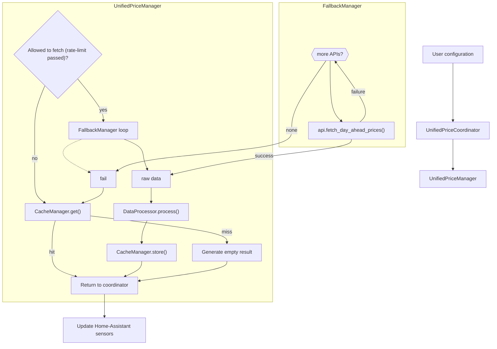
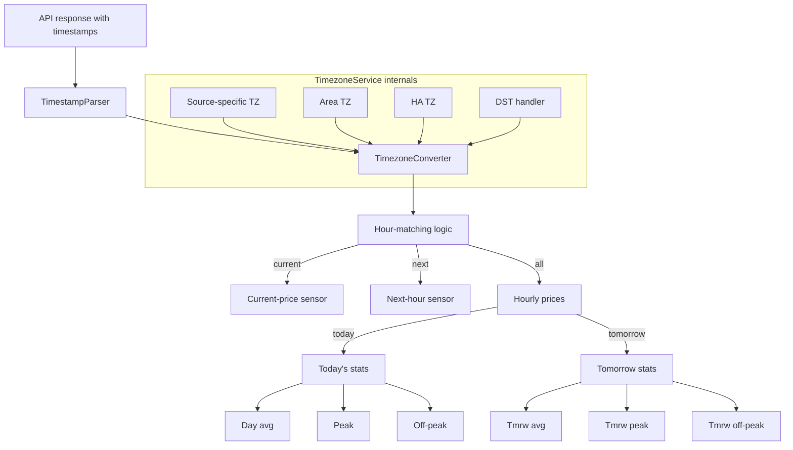
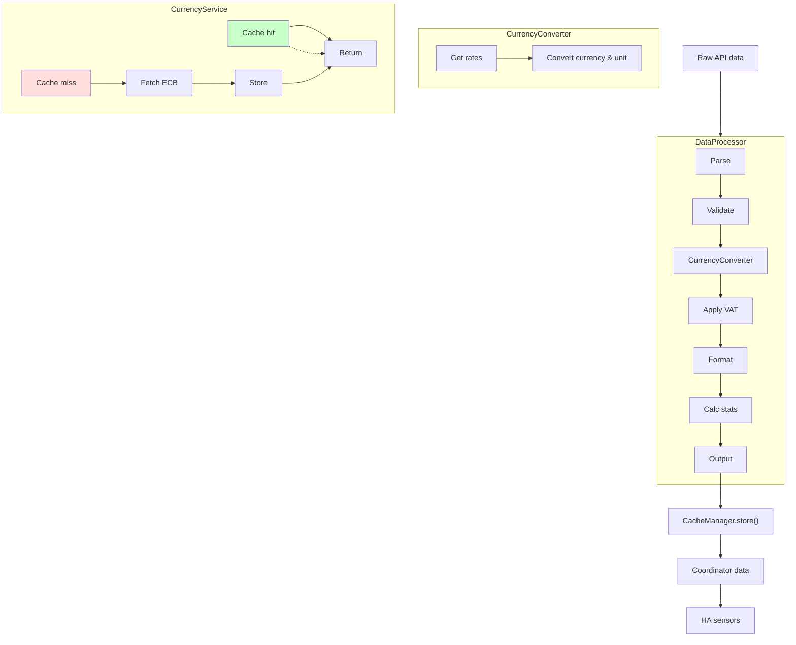
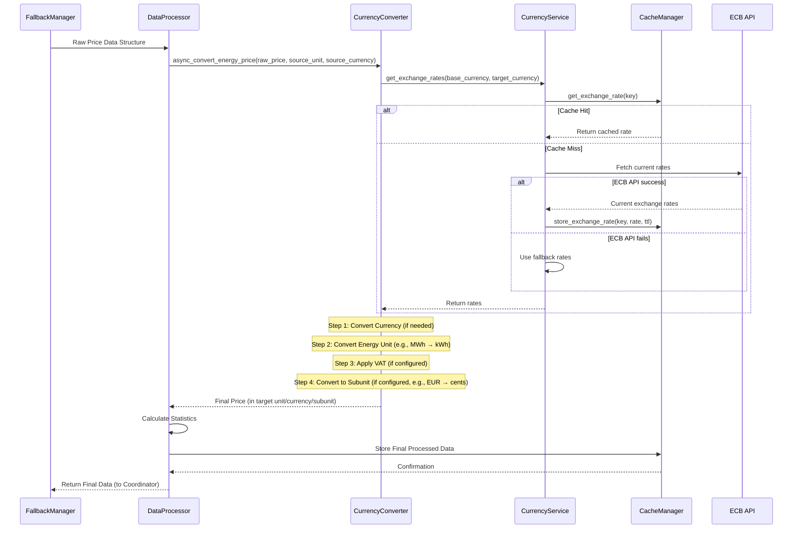
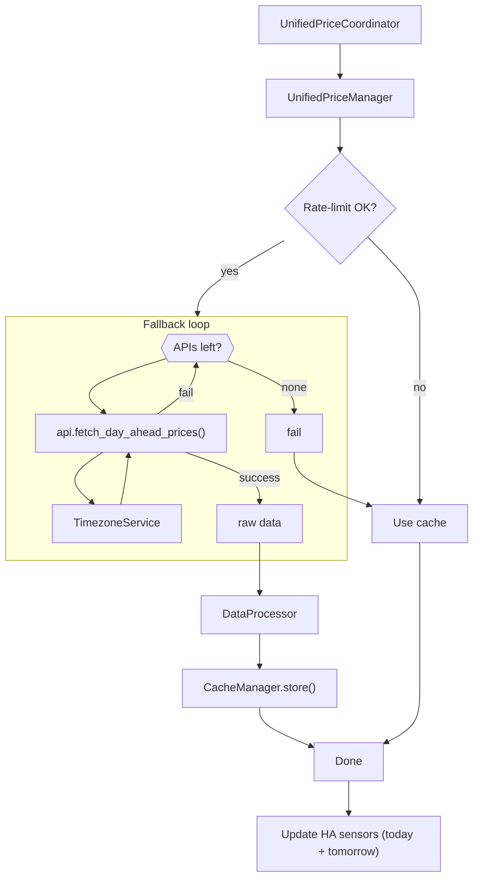

# GE-Spot: Global Electricity Spot Prices Integration for Home Assistant

 

> *"Hit the right spot with your energy prices"*


This custom integration allows you to fetch day-ahead electricity spot prices from various trustworthy global sources for use in automations, dashboards, and energy monitoring within Home Assistant.

## Table of Contents

- [Installation](#installation)
- [Supported Price Sources & Regions](#supported-price-sources--regions)
- [Features](#features)
- [Configuration](#configuration)
- [Multi-Source API & Fallback System](#multi-source-api--fallback-system)
- [Technical Features](#technical-features)
  - [Timezone Handling](#timezone-handling)
  - [Price Conversion Logic](#price-conversion-logic)
  - [Currency Conversion](#currency-conversion)
  - [Price Differences Between Sources](#price-differences-between-sources)
  - [Ensuring Consistent Hour Alignment](#ensuring-consistent-hour-alignment)
- [Usage Examples](#usage-examples)
- [Troubleshooting](#troubleshooting)
- [For Developers](#for-developers)

## Installation

### HACS Installation (Recommended)

1. Make sure [HACS](https://hacs.xyz/) is installed
2. Add this repository as a custom repository in HACS
3. Click "Add"
4. Search for "GE-Spot: Global Electricity Spot Prices"
5. Click Install
6. Restart Home Assistant

### Manual Installation

1. Copy the `ge_spot` directory from this repository to your Home Assistant's `custom_components` directory
2. Restart Home Assistant

## Supported Price Sources & Regions

The integration supports multiple price data sources with automatic fallback capabilities:

- **Nordpool** - Prices for Nordic and Baltic countries
- **Energi Data Service** - Prices for Denmark
- **Stromligning** - Prices for Denmark
- **ENTSO-E** - European Network of Transmission System Operators for Electricity (requires API key)
- **OMIE** - Iberian Electricity Market Operator for Spain and Portugal
- **EPEX SPOT** - European Power Exchange for Central Europe **(WIP)**
- **AEMO** - Australian Energy Market Operator **(WIP)**
- **ComEd** - Commonwealth Edison hourly pricing for Chicago area (USA) **(WIP)**
- **Amber** - Amber Electric for Australia **(WIP - Not yet fully integrated/listed in matrix)**

### Region Support Matrix

The table below shows which price sources support specific regions:

| Region | Description | Nordpool | ENTSO-E | Energi Data | Stromligning | EPEX (WIP) | OMIE | AEMO (WIP) | ComEd (WIP) | Amber (WIP) |
|--------|-------------|:--------:|:-------:|:-----------:|:------------:|:----------:|:----:|:----------:|:-----------:|:-----------:|
| SE1    | Sweden North | ✓ | ✓ | | | | | | | |
| SE2    | Sweden North-Central | ✓ | ✓ | | | | | | | |
| SE3    | Sweden South-Central | ✓ | ✓ | | | | | | | |
| SE4    | Sweden South | ✓ | ✓ | | | | | | | |
| DK1    | Denmark West | ✓ | ✓ | ✓ | ✓ | | | | | |
| DK2    | Denmark East | ✓ | ✓ | ✓ | ✓ | | | | | |
| NO1-4  | Norway Areas | ✓ | ✓ | | | | | | | |
| FI     | Finland | ✓ | ✓ | | | | | | | |
| EE     | Estonia | ✓ | ✓ | | | | | | | |
| LV     | Latvia | ✓ | | | | | | | | |
| LT     | Lithuania | ✓ | | | | | | | | |
| DE     | Germany | | ✓ | | | ✓ | | | | |
| FR     | France | | ✓ | | | ✓ | | | | |
| NL     | Netherlands | | ✓ | | | ✓ | | | | |
| BE     | Belgium | | ✓ | | | ✓ | | | | |
| AT     | Austria | | ✓ | | | ✓ | | | | |
| ES     | Spain | | ✓ | | | | ✓ | | | |
| PT     | Portugal | | ✓ | | | | ✓ | | | |
| NSW1   | Australia NSW | | | | | | | ✓ | | ✓ |
| QLD1   | Australia Queensland | | | | | | | ✓ | | ✓ |
| SA1    | Australia South | | | | | | | ✓ | | ✓ |
| TAS1   | Australia Tasmania | | | | | | | ✓ | | ✓ |
| VIC1   | Australia Victoria | | | | | | | ✓ | | ✓ |
| US-IL  | Chicago Area | | | | | | | | ✓ | |

For a complete list of supported areas and their currency mappings, see the [Const files](custom_components/ge_spot/const/areas.py) in the codebase.

## Features

- Simple configuration through the Home Assistant UI
- Region-specific setup options
- Source-agnostic sensors that provide consistent entity IDs regardless of data source
- Tomorrow's prices available after 13:00 CET (when published)
- Automatic fallback between data sources for the same region for increased reliability
- Seamless timezone handling to ensure correct hourly price display regardless of API source
- Currency conversion with dynamic exchange rates from the European Central Bank
- Timestamps in ISO format for compatibility with other systems
- Provides the following sensors for each configured region:
  - **Current Price:** The electricity spot price for the current hour in your chosen display unit (e.g., cents/kWh).
  - **Next Hour Price:** The electricity spot price for the upcoming hour.
  - **Average Price:** The average electricity spot price calculated across all hours of the current day (today).
  - **Peak Price:** The highest hourly electricity spot price encountered during the current day (today).
  - **Off-Peak Price:** The lowest hourly electricity spot price encountered during the current day (today).
  - **Price Difference:** The absolute difference between the *Current Price* and the *Average Price* for today. A negative value indicates the current price is below the daily average.
  - **Price Percentage:** The relative difference between the *Current Price* and the *Average Price* for today, expressed as a percentage of the average price. A negative percentage indicates the current price is below the daily average.
  - **Tomorrow Average Price:** The average electricity spot price calculated across all hours of the *next* day (tomorrow). This sensor becomes available once tomorrow's prices are published by the source (typically around 13:00-14:00 CET).
  - **Tomorrow Peak Price:** The highest hourly electricity spot price forecast for the *next* day (tomorrow). Becomes available when tomorrow's prices are published.
  - **Tomorrow Off-Peak Price:** The lowest hourly electricity spot price forecast for the *next* day (tomorrow). Becomes available when tomorrow's prices are published.

## Configuration

After installation:

1. Go to Configuration → Integrations
2. Click "Add Integration" and search for "GE-Spot: Global Electricity Spot Prices"
3. Select your region/area from the dropdown
4. Configure settings:

### Basic Settings

- **Region/Area**: Select your electricity price area (e.g., SE4, DK1)
- **Source Priority**: Order of data sources to try (first = highest priority)
- **VAT Rate**: Set your applicable VAT percentage (e.g., 25 for 25%)
- **Update Interval**: How often to refresh data (15, 30, or 60 minutes)

### Advanced Settings

- **Display Format**: Choose between decimal (e.g., 0.15 EUR/kWh) or subunit (e.g., 15 cents/kWh)
- **API Keys**: For ENTSO-E, you'll need to [register for an API key](https://transparency.entsoe.eu/content/static_content/Static%20content/web%20api/Guide.html)
- **API Key Reuse**: The integration will reuse API keys across different regions using the same source

### VAT Handling

The integration handles VAT correctly based on your configuration:
- Enter VAT as a percentage (e.g., 25 for 25%)
- VAT is applied to the converted price after any currency conversion
- Some sources like Stromligning already include VAT in their prices

### Error Recovery and Rate Limiting

The integration implements several mechanisms to ensure reliability:

- **Automatic Retries**: Failed API requests are retried with exponential backoff
- **Source Fallbacks**: If the primary source fails, alternative sources are tried automatically
- **Data Caching**: Successfully fetched data is cached and used if all API sources fail
- **Rate Limiting**: Minimum update interval of 15 minutes to respect API rate limits
- **Special Update Windows**: More frequent updates during price publication times (around 13:00 CET)

## Multi-Source API & Fallback System

GE-Spot uses a robust multi-source approach to ensure reliable price data:



## Technical Features

### Timezone Handling

The integration normalizes timestamps from different APIs to ensure correct hourly prices:



- **Timezone Awareness**: Handles UTC, local time, and timezone-naive timestamps correctly
- **Region-specific Handling**: Applies appropriate timezone for each price area
- **Home Assistant Integration**: Uses your Home Assistant timezone setting for consistent display

### Price Conversion Logic

The integration implements a comprehensive price conversion system that ensures accurate pricing across all regions and currencies:



The price conversion follows this detailed process:



### Currency Conversion

GE-Spot makes currency conversion simple and reliable:

- **Automatic Currency Detection**: Appropriate currency selected based on region
- **Dynamic Exchange Rates**: Fresh rates from the European Central Bank
- **Smart Caching**: Exchange rates are cached for 24 hours to reduce API calls
- **Scheduled Updates**: Exchange rates are refreshed at 00:00, 06:00, 12:00, and 18:00
- **Fallback Rates**: Works even during network outages using cached values
- **Display Flexibility**: Show prices in main units (EUR/kWh) or subunits (cents/kWh, öre/kWh)

For example, converting from 69.16 EUR/MWh to öre/kWh for SE4 (with exchange rate 10.72):
1. EUR to SEK: 69.16 × 10.72 = 741.40 SEK/MWh
2. MWh to kWh: 741.40 ÷ 1000 = 0.7414 SEK/kWh
3. Apply VAT (if any): 0.7414 × (1 + VAT rate)
4. SEK to öre (if requested): 0.7414 × 100 = 74.14 öre/kWh

### Price Differences Between Sources

Different data sources will return different prices for the same hour due to what they include:

| Source | Price Components | Notes |
|--------|------------------|-------|
| Energi Data Service/ENTSO-E | Raw spot price | Base wholesale electricity market price |
| Nordpool | Raw spot price | May differ slightly due to timing/rounding |
| Stromligning | Spot price + grid fees + tariffs + taxes | Full consumer electricity price |
| ComEd (WIP) | Hourly real-time pricing | 5-minute and hourly average options |
| EPEX (WIP) | Raw spot price | Similar to ENTSO-E |
| OMIE | Raw spot price | Similar to ENTSO-E |
| AEMO (WIP) | Raw spot price | Australian market specifics |
| Amber (WIP) | Spot price + network fees + carbon costs | Includes additional components |

For Danish areas (DK1, DK2), the integration extracts only the electricity component from Stromligning to match other price sources. The full price breakdown with all components is available in the sensor attributes.

### Ensuring Consistent Hour Alignment

To ensure all sources report prices for the same hours despite different source timezones:

1. Each API response is processed with explicit timezone awareness
2. Timestamps are parsed in their original timezone context
3. Hours are normalized to the Home Assistant timezone
4. DST transitions are handled automatically

This ensures that, for example, the price for 14:00 is the same regardless of which API provided it.

### Tomorrow's Data Fetching

The integration implements a sophisticated system for fetching tomorrow's electricity prices:



## Usage Examples

### Basic Dashboard Card

```yaml
type: entities
entities:
  - entity: sensor.gespot_current_price_se4
    name: Current Electricity Price
  - entity: sensor.gespot_next_hour_price_se4
    name: Next Hour Price
  - entity: sensor.gespot_day_average_price_se4
    name: Today's Average
  - entity: sensor.gespot_tomorrow_average_price_se4
    name: Tomorrow's Average
```

### Price Graph Card

```yaml
type: custom:apexcharts-card
header:
  show: true
  title: Electricity Prices
  show_states: true
series:
  - entity: sensor.gespot_current_price_se4
    attribute: today_with_timestamps
    type: column
    name: Today
    group_by:
      func: raw
  - entity: sensor.gespot_current_price_se4
    attribute: tomorrow_with_timestamps
    type: column
    name: Tomorrow
    group_by:
      func: raw
```

### Price-Based Automation

```yaml
automation:
  - alias: Turn on water heater when prices are low
    trigger:
      - platform: state
        entity_id: sensor.gespot_current_price_se4
    condition:
      - condition: template
        value_template: "{{ states('sensor.gespot_current_price_se4')|float < states('sensor.gespot_day_average_price_se4')|float * 0.8 }}"
    action:
      - service: switch.turn_on
        entity_id: switch.water_heater
```

### Energy Dashboard Integration

To integrate GE-Spot with the Energy Dashboard, you can create template sensors:

```yaml
template:
  - sensor:
      - name: "Energy Cost Sensor"
        unit_of_measurement: "SEK/kWh"
        state: "{{ states('sensor.gespot_current_price_se4') }}"
```

Then set this sensor as your energy cost sensor in the Energy Dashboard settings.

## Troubleshooting

If you experience issues:

### Common Problems

- **No Data/Empty Sensors**: Check if your area is correctly supported by your selected source
- **API Key Errors**: For ENTSO-E, verify your API key is entered correctly
- **Timezone Issues**: Check if the hourly prices align with your expected hours
- **Missing Tomorrow Prices**: Tomorrow's prices are typically only available after 13:00 CET

### Diagnostic Steps

1. Check sensor attributes for detailed information:
   - `data_source`: Which API provided the data
   - `active_source`: Current active source being used
   - `fallback_sources`: Alternative sources that succeeded
   - `attempted_sources`: All sources that were tried
   - `using_cached_data`: Whether cached data is being used

2. Check Home Assistant logs for errors related to `ge_spot`

3. Verify network connectivity to the API endpoints

4. Try increasing the update interval if you experience frequent timeouts

### Improving Reliability

- Configure multiple sources in your priority list
- Get an ENTSO-E API key for better fallback options
- Use longer update intervals (30 or 60 minutes)
- Check if your internet connection is stable

## For Developers

### Architecture Overview

GE-Spot follows a modular architecture with clear separation of concerns:

```
custom_components/ge_spot/
├── api/                  # API clients for different price sources
│   ├── parsers/          # Dedicated parsers for each API source
│   └── base/             # Base classes for API functionality
├── const/                # Constants and configuration
├── coordinator/          # Data coordination and management
├── price/                # Price data processing and conversion
├── sensor/               # Sensor implementations
├── timezone/             # Timezone handling and conversion
└── utils/                # Utility functions and classes
    ├── error/            # Error handling and recovery
    ├── fallback/         # Fallback mechanisms
    └── validation/       # Data validation
```

### API System

The API system is designed to be extensible and fault-tolerant:

1. **API Registry**: Central registry of all API sources
2. **Source Prioritization**: APIs are tried in priority order
3. **Fallback Chains**: Each source has a defined fallback chain
4. **Data Validation**: Robust validation of API responses
5. **Error Recovery**: Automatic retry with exponential backoff

### Adding a New Price Source

To add a new price source:

1. Create a new API module in `custom_components/ge_spot/api/`
2. Implement the `fetch_day_ahead_prices` function following the pattern in existing modules
3. Create a dedicated parser in `custom_components/ge_spot/api/parsers/`
4. Register the source in `api/__init__.py` and add to the `SOURCE_REGION_SUPPORT` mapping
5. Add region mappings in the `const/areas.py` file
6. Update the fallback chain in `ApiRegistry.get_fallback_chain()` to include the new source

### Standardized Return Format

All API modules should return data in this format:

```python
{
    "current_price": float,           # Current hour price
    "next_hour_price": float,         # Next hour price
    "day_average_price": float,       # Day average
    "peak_price": float,              # Day maximum
    "off_peak_price": float,          # Day minimum
    "hourly_prices": dict,            # Hourly prices "HH:00" -> float
    "tomorrow_hourly_prices": dict,   # Tomorrow's hourly prices (if available)
    "raw_values": dict,               # Raw conversion information
    "data_source": str,               # Source name
    "last_updated": str,              # ISO timestamp
    "currency": str                   # Target currency
}
```

### Error Handling System

The error handling system provides:

1. **Error Classification**: Errors are classified by type for better handling
2. **Error Recovery**: Automatic retry with exponential backoff for transient errors
3. **Error Tracking**: Comprehensive tracking of errors for better diagnostics
4. **API Health Monitoring**: Continuous monitoring of API health to detect issues early

### Fallback System

The fallback system ensures reliability:

1. **Source Health Tracking**: Track the health of each data source
2. **Intelligent Fallback**: Automatically fall back to alternative sources when primary sources fail
3. **Data Quality Scoring**: Score data quality to choose the best source
4. **Cached Fallback**: Use cached data when all sources fail

### Testing

The integration includes comprehensive test scripts:

#### API Tests

Test the basic functionality of all APIs:

```bash
python scripts/tests/test_all_apis.py
```

#### Date Range Tests

Test the date range utility with all APIs:

```bash
python scripts/tests/test_date_range_apis.py
```

#### Timezone Tests

Test timezone handling and conversion:

```bash
python scripts/tests/test_timezone_handling.py
```

These tests verify that each API correctly handles different date ranges, timezone conversions, and edge cases. This is particularly important for ensuring consistent behavior across different regions and time periods.

### Performance Optimization

The integration includes several performance optimizations:

1. **Parallel Fetching**: Fetch data from multiple sources in parallel
2. **Priority-Based Fetching**: Fetch from sources in priority order
3. **Advanced Caching**: Sophisticated caching with TTL and invalidation
4. **Reduced Network Load**: Conditional requests and rate limiting

### Tomorrow's Data Fetching

The integration implements a sophisticated system for fetching tomorrow's electricity prices:

```mermaid
flowchart TD
    Coordinator[UnifiedPriceCoordinator] -- Triggers Update (Regular Interval) --> Manager[UnifiedPriceManager]
    Manager --> CheckRateLimit{Rate Limit Check}
    CheckRateLimit -- OK --> CallFallback[Call FallbackManager]
    CheckRateLimit -- Blocked --> UseCacheOrWait[Use Cache / Wait]
    CallFallback --> FallbackMgr[FallbackManager]

    subgraph FallbackMgrLogic ["FallbackManager: Try APIs in Priority"]
        APICall["API Instance: fetch_day_ahead_prices"]
        APICall -- Uses --> TZService[TimezoneService]
        TZService -- Determines --> DateRange["Date Range (Today/Tomorrow based on current time)"]
        APICall -- Requests --> ExternalAPI["External API Source"]
        ExternalAPI -- Returns --> RawData["Raw Data (Today + Tomorrow if available)"]
        APICall -- Success --> ReturnRawData["Return Raw Data Structure"]
        APICall -- Failure --> TryNext["Try Next API or Fail"]
    end

    FallbackMgr -- Raw Data --> Manager
    FallbackMgr -- Failure --> Manager
    Manager -- Success --> ProcessData["DataProcessor: Process Today & Tomorrow Data"]
    Manager -- Failure --> UseCacheOrFail["Use Cache / Generate Empty"]
    ProcessData --> StoreCache["CacheManager: Store Result"]
    StoreCache --> UpdateCoord["Update Coordinator Data"]
    UseCacheOrFail --> UpdateCoord
    UpdateCoord --> Sensors["Update HA Sensors (incl. Tomorrow if data exists)"]

    
note over TZService: Helps determine if publication time (e.g., ~13:00 CET) has passed to include tomorrow's date range.;
note over APICall: Fetches data for the date range determined via TimezoneService. Handles API specifics.;
note over ProcessData: Calculates stats for both today and tomorrow if data is present in the raw response.;
```

This approach ensures that tomorrow's price data is fetched efficiently as part of the regular update cycle once it becomes available from the source APIs, without needing complex dedicated scheduling.

## License

This integration is licensed under the MIT License.
