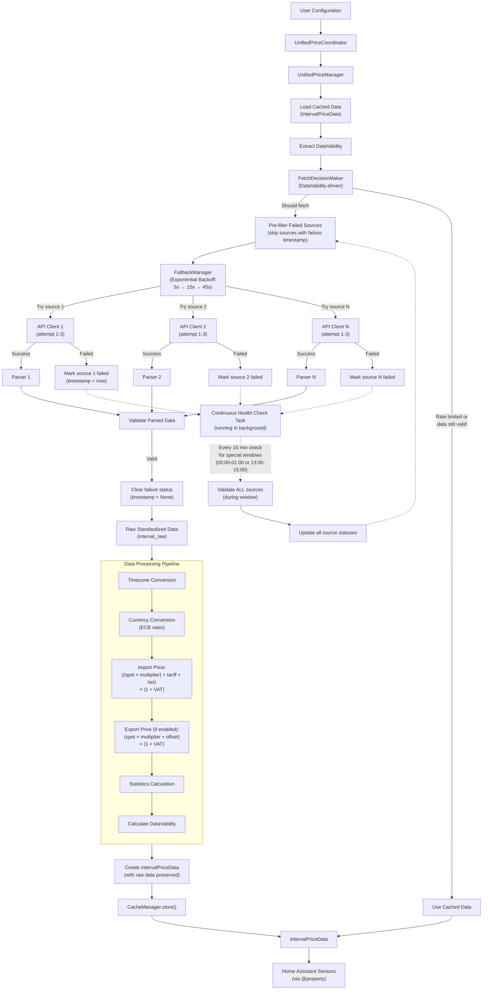
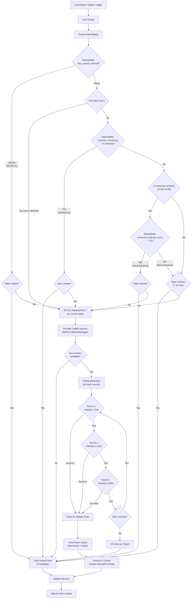
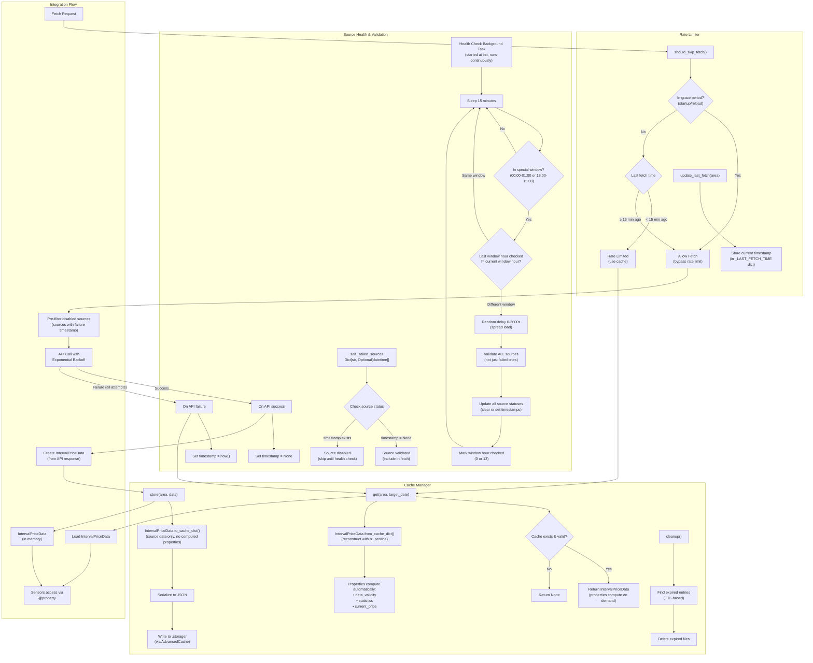
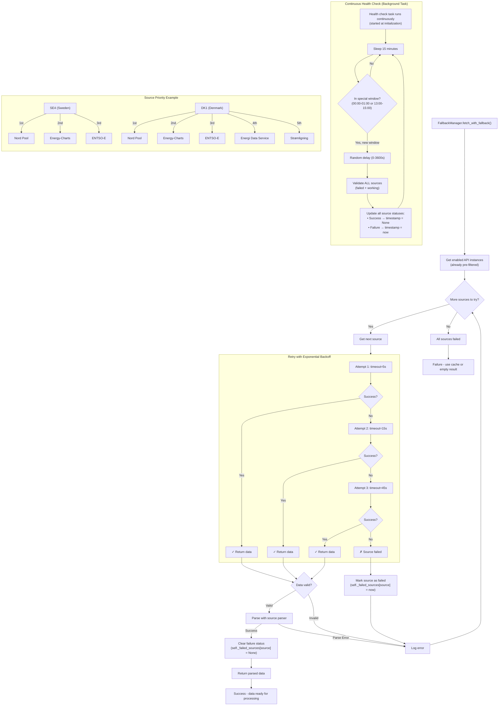

# GE-Spot: Global Electricity Spot Prices for Home Assistant

  [](https://github.com/hacs/integration) [](https://github.com/sponsors/enoch85)


Home Assistant integration providing **electricity spot prices** from global markets with 15-minute intervals, automatic source fallback, and prosumer support (import/export pricing).

> Hit the right spot with your energy prices

If you find this project useful, please consider sponsoring the development on GitHub Sponsors: https://github.com/sponsors/enoch85

## Table of Contents

- [Installation](#installation)
- [Supported Sources & Regions](#supported-sources--regions)
- [Features](#features)
- [Configuration](#configuration)
- [Usage Examples](#usage-examples)
- [Troubleshooting](#troubleshooting)
- [Architecture](#architecture)
- [For Developers](#for-developers)

## Installation

### HACS (Recommended)

[](https://my.home-assistant.io/redirect/hacs_repository/?owner=enoch85&repository=ge-spot&category=integration)

1. Install [HACS](https://hacs.xyz/)
2. Search for "GE-Spot" in HACS → Integrations
3. Download, restart Home Assistant
4. Add via Settings → Devices & Services → Add Integration

### Manual

1. Copy `custom_components/ge_spot` to your `custom_components` directory
2. Restart Home Assistant

## Supported Sources & Regions

The integration supports multiple price data sources with automatic fallback capabilities:

| Source | Coverage | Notes |
|--------|----------|-------|
| **Nordpool** | Nordic, Baltic, Central Europe | DE, AT, BE, FR, NL, PL, NO, SE, DK, FI, EE, LT, LV |
| **ENTSO-E** | Pan-European | Requires [API key](https://transparency.entsoe.eu/) |
| **Energy-Charts** | European spot prices | DE, FR, NL, BE, AT, IT, ES, and more |
| **Energi Data Service** | Denmark | DK1, DK2 |
| **Strømligning** | Denmark | Includes grid fees and taxes |
| **OMIE** | Iberian Peninsula | ES, PT |
| **AEMO** | Australia | NSW, QLD, SA, TAS, VIC |
| **ComEd** | Chicago area | Real-time pricing (5-min) |
| **Amber** | Australia | Includes network + carbon costs |

<details>
<summary><b>Full Region Support Matrix</b></summary>

| Region | Nordpool | ENTSO-E | Energy-Charts | Energi Data | Strømligning | OMIE | AEMO | ComEd | Amber |
|--------|:--------:|:-------:|:-------------:|:-----------:|:------------:|:----:|:----:|:-----:|:-----:|
| AT | ✓ | ✓ | ✓ | | | | | | |
| BE | ✓ | ✓ | ✓ | | | | | | |
| BG | | ✓ | ✓ | | | | | | |
| CH | | ✓ | ✓ | | | | | | |
| ComEd | | | | | | | | ✓ | |
| CZ | | ✓ | ✓ | | | | | | |
| DE | ✓ | ✓ | ✓ | | | | | | |
| DE-LU | ✓ | ✓ | ✓ | | | | | | |
| DK1-2 | ✓ | ✓ | ✓ | ✓ | ✓ | | | | |
| EE | ✓ | ✓ | ✓ | | | | | | |
| ES | | ✓ | ✓ | | | ✓ | | | |
| FI | ✓ | ✓ | ✓ | | | | | | |
| FR | ✓ | ✓ | ✓ | | | | | | |
| GR | | ✓ | ✓ | | | | | | |
| HR | | ✓ | ✓ | | | | | | |
| HU | | ✓ | ✓ | | | | | | |
| IT-* | | ✓ | ✓ | | | | | | |
| LT | ✓ | ✓ | ✓ | | | | | | |
| LV | ✓ | | ✓ | | | | | | |
| NL | ✓ | ✓ | ✓ | | | | | | |
| NO1-5 | ✓ | ✓ | ✓ | | | | | | |
| NSW1 | | | | | | | ✓ | | ✓ |
| PL | ✓ | ✓ | ✓ | | | | | | |
| PT | | ✓ | ✓ | | | ✓ | | | |
| QLD1 | | | | | | | ✓ | | ✓ |
| RO | | ✓ | ✓ | | | | | | |
| SA1 | | | | | | | ✓ | | ✓ |
| SE1-4 | ✓ | ✓ | ✓ | | | | | | |
| SI | | ✓ | ✓ | | | | | | |
| SK | | ✓ | ✓ | | | | | | |
| TAS1 | | | | | | | ✓ | | ✓ |
| VIC1 | | | | | | | ✓ | | ✓ |

</details>

For complete area mappings, see [const/areas.py](custom_components/ge_spot/const/areas.py).

## Features

**Core:**
- 15-minute interval output (96 data points/day), DST-aware (92-100 intervals on transitions)
- Supports hourly, 30-minute, 15-minute, and 5-minute source data (normalized to 15-min output)
- Multi-source fallback with automatic switching
- Live ECB currency conversion
- Timezone normalization across all sources

**Import/Export Pricing:**
- **Import multiplier** - Scale spot price before fees (e.g., Belgian tariffs: `spot × 0.1068`)
- **Export sensors** - Separate pricing for prosumers selling electricity
- Formula: `Import: ((spot × multiplier) + tariff + tax) × (1 + VAT)`
- Formula: `Export: (spot × multiplier + offset) × (1 + VAT)`

**Sensors Created (per region):**

| Entity ID | Description |
|-----------|-------------|
| `sensor.gespot_current_price_{area}` | Current 15-min interval price |
| `sensor.gespot_next_interval_price_{area}` | Upcoming interval price |
| `sensor.gespot_average_price_{area}` | Today's average |
| `sensor.gespot_peak_price_{area}` | Today's peak (highest) |
| `sensor.gespot_off_peak_price_{area}` | Today's off-peak (lowest) |
| `sensor.gespot_price_difference_{area}` | Current vs average (absolute) |
| `sensor.gespot_price_percentage_{area}` | Current vs average (%) |
| `sensor.gespot_hourly_average_price_{area}` | Current hour's average |
| `sensor.gespot_tomorrow_average_price_{area}` | Tomorrow's average |
| `sensor.gespot_tomorrow_peak_price_{area}` | Tomorrow's peak |
| `sensor.gespot_tomorrow_off_peak_price_{area}` | Tomorrow's off-peak |
| `sensor.gespot_export_current_price_{area}`* | Export price (current) |
| `sensor.gespot_export_average_price_{area}`* | Export average |
| `sensor.gespot_export_peak_price_{area}`* | Export peak |

*Export sensors created when "Enable Export Prices" is configured. Replace `{area}` with your region code (e.g., `se4`, `dk1`, `nsw1`).

**Integrations:** Compatible with [EV Smart Charging](https://github.com/jonasbkarlsson/ev_smart_charging) via `today_interval_prices` and `tomorrow_interval_prices` attributes.

See [docs/hourly_average_sensors.md](docs/hourly_average_sensors.md) for details on hourly average sensors.

## Configuration

1. Go to Settings → Devices & Services → Add Integration
2. Search for "GE-Spot" and select your region/area
3. Enable all sources to activate fallback
4. Configure source priority (first = highest priority)

### Settings

| Setting | Description |
|---------|-------------|
| **VAT Rate** | Your local VAT % (e.g., 25 for 25%) |
| **Import Multiplier** | Scale spot price before fees (e.g., 0.107 for Belgian tariffs) |
| **Additional Tariff** | Grid/transfer fees per kWh (applied before VAT) |
| **Energy Tax** | Government levy per kWh (applied before VAT) |
| **Display Format** | Decimal (0.15 EUR/kWh) or subunit (15 cents/kWh) |
| **ENTSO-E API Key** | Required for ENTSO-E source ([register here](https://transparency.entsoe.eu/)) |
| **Export Enabled** | Enable export/feed-in price sensors for prosumers |
| **Export Multiplier/Offset/VAT** | Configure export pricing formula |

### Reliability

- **Rate limiting**: 15-minute minimum between fetches
- **Retries**: Exponential backoff (5s → 15s → 45s)
- **Validation**: DST-aware interval counting (92/96/100 intervals)
- **Fallback**: Automatic source switching on incomplete data
- **Health checks**: Daily validation of all configured sources

## Usage Examples

### Basic Dashboard Card

```yaml
type: entities
entities:
  - entity: sensor.gespot_current_price_se4
    name: Current Electricity Price (15-min interval)
  - entity: sensor.gespot_next_interval_price_se4
    name: Next Interval Price
  - entity: sensor.gespot_average_price_se4
    name: Today's Average
  - entity: sensor.gespot_hourly_average_price_se4
    name: Current Hour Average
  - entity: sensor.gespot_tomorrow_average_price_se4
    name: Tomorrow's Average
```

### Price Graph Card


```yaml
type: custom:apexcharts-card
now:
  show: true
  label: ""
graph_span: 2d
span:
  start: day
apex_config:
  chart:
    height: 300px
  legend:
    show: false
  xaxis:
    labels:
      format: HH:mm
  grid:
    borderColor: "#e0e0e0"
    strokeDashArray: 3
  tooltip:
    x:
      format: HH:mm
  annotations:
    yaxis:
      - "y": 0
        yAxisIndex: 0
        strokeDashArray: 0
        borderColor: rgba(128, 128, 128, 0.8)
        borderWidth: 2
        opacity: 1
yaxis:
  - id: watts
    decimals: 0
  - id: price
    decimals: 0
    opposite: true
experimental:
  color_threshold: true
series:
  - entity: sensor.gespot_current_price_se4
    name: Price (öre)
    type: area
    curve: stepline
    yaxis_id: price
    extend_to: now
    stroke_width: 0
    opacity: 0.7
    data_generator: |
      return [
        ...(entity.attributes.today_interval_prices || []).map(item => [new Date(item.time), item.value]),
        ...(entity.attributes.tomorrow_interval_prices || []).map(item => [new Date(item.time), item.value])
      ];
    color_threshold:
      - value: -50
        color: cyan
      - value: 0
        color: green
      - value: 40
        color: orange
      - value: 100
        color: red
      - value: 200
        color: magenta
      - value: 500
        color: black
  - entity: sensor.YOUR_ENERGY_METER
    name: Watts
    type: line
    curve: smooth
    yaxis_id: watts
    color: "#FF0000"
    stroke_width: 2
    opacity: 0.5
    extend_to: false
    group_by:
      func: avg
      duration: 5min
update_interval: 300s
```

### Sensor Attributes

Interval prices are exposed via sensor attributes for automations and charts:

```json
{
  "today_interval_prices": [
    {"time": "2025-10-14T00:00:00+02:00", "value": 0.0856, "raw_value": 0.0754},
    {"time": "2025-10-14T00:15:00+02:00", "value": 0.0842, "raw_value": 0.0740}
  ],
  "tomorrow_interval_prices": [...]
}
```

| Field | Description |
|-------|-------------|
| `time` | ISO 8601 datetime in Home Assistant timezone |
| `value` | Final price (VAT, tariffs, taxes applied) |
| `raw_value` | Market spot price (currency/unit converted only) |

**Price Formula:**
```
value = (((raw_value × import_multiplier) + tariff + tax) × (1 + VAT%)) × display_multiplier
```

**Template Examples:**
```yaml
# Price at 14:00
{{ state_attr('sensor.gespot_current_price_se3', 'today_interval_prices') 
   | selectattr('time', 'search', 'T14:00') | map(attribute='value') | first }}

# Average raw market price

{{ prices | map(attribute='raw_value') | average | round(4) }}

# Count negative price intervals
{{ state_attr('sensor.gespot_current_price_se3', 'today_interval_prices') 
   | map(attribute='raw_value') | select('<', 0) | list | length }}
```

### Automation Example

```yaml
automation:
  - alias: Turn on water heater when prices are low
    trigger:
      - platform: state
        entity_id: sensor.gespot_current_price_se4
    condition:
      - condition: template
        value_template: "{{ states('sensor.gespot_current_price_se4')|float < states('sensor.gespot_average_price_se4')|float * 0.8 }}"
    action:
      - service: switch.turn_on
        entity_id: switch.water_heater
```

## Energy Dashboard Integration

To integrate GE-Spot with the Energy Dashboard, create template sensors:

```yaml
template:
  - sensor:
      - name: "Energy Cost Sensor"
        unit_of_measurement: "SEK/kWh"
        state: "{{ states('sensor.gespot_current_price_se4') }}"
```

Then set this sensor as your energy cost sensor in the Energy Dashboard settings.

## Troubleshooting

| Issue | Solution |
|-------|----------|
| No data | Check area is supported by selected source |
| API key errors | Verify ENTSO-E API key if using that source |
| Missing tomorrow prices | Available after 13:00 CET daily |
| 96 data points | Correct! 15-min intervals = 96/day (92 spring DST, 100 fall DST) |
| Incomplete data warnings | System auto-switches sources; configure multiple for reliability |

### Source Health Monitoring

Check sensor attributes for source health information:

```yaml
sensor.gespot_current_price_se4
  attributes:
    source_info:
      active_source: "nordpool"           # Currently used source
      validated_sources:                   # Sources that are working
        - "nordpool"
        - "entsoe"
      failed_sources:                      # Sources that failed (if any)
        - source: "energy_charts"
          failed_at: "2025-10-10T17:36:42+02:00"
          retry_at: "2025-10-11T13:00:00+02:00"
```

**Key Attributes:**
- `active_source` - Currently used source
- `validated_sources` - Working sources  
- `failed_sources` - Failed sources with retry schedule
- `using_cached_data` - Whether cache is being used

## For Developers

### Project Structure

```
custom_components/ge_spot/
├── api/                  # API clients and parsers
│   ├── base/             # Base classes (BasePriceAPI, error handling)
│   ├── parsers/          # Source-specific data parsers
│   └── *.py              # API clients (nordpool.py, entsoe.py, etc.)
├── coordinator/          # Data coordination
│   ├── unified_price_manager.py  # Main orchestrator
│   ├── fallback_manager.py       # Source fallback logic
│   ├── data_processor.py         # Price processing pipeline
│   └── cache_manager.py          # TTL-based caching
├── price/                # Currency/unit conversion
├── sensor/               # Home Assistant entities
├── timezone/             # DST-aware interval handling
├── const/                # Configuration constants
└── utils/                # Exchange rates, validation
```

### Adding a New Source

1. Create `api/new_source.py` extending `BasePriceAPI`
2. Create `api/parsers/new_source_parser.py` returning `interval_raw` dict
3. Register in `const/sources.py` and `const/areas.py`
4. Add to `coordinator/unified_price_manager.py` `_source_api_map`
5. Add tests in `tests/pytest/unit/`

### Testing

```bash
pytest tests/pytest/unit/           # Unit tests
pytest tests/pytest/integration/    # Integration tests
./scripts/run_pytest.sh             # Full test suite
```

### Contributing

Check [TODO/README.md](/TODO/README.md) for contribution opportunities organized by category (testing, code quality, documentation, enhancements).

---

## Architecture

### 1. Data Flow Architecture



### 2. Fetch Decision Logic



### 3. Cache and Rate Limiter



### 4. Fallback System



---

**For detailed cache architecture documentation**, see [docs/cache_compute_on_demand.md](/docs/cache_compute_on_demand.md)

---

### Key Components

| Component | Responsibility |
|-----------|---------------|
| `UnifiedPriceManager` | Orchestrates fetching, caching, and sensor updates |
| `FallbackManager` | Tries sources in priority order with exponential backoff (5s→15s→45s) |
| `DataProcessor` | Normalizes timezones, converts currency, applies import/export pricing |
| `CacheManager` | TTL-based storage with deep-copy mutation protection |
| `IntervalPriceData` | Dataclass with computed properties for sensors |
| `FetchDecisionMaker` | Uses DataValidity to decide when to fetch |
| `DataValidity` | Tracks data coverage and expiration timestamps |

### Interval Resolution

| Source | Native | Output |
|--------|--------|--------|
| ENTSO-E/Nordpool/Energy-Charts | 15-60 min | 96 intervals/day |
| OMIE/Strømligning | 60 min | Expanded to 15-min |
| AEMO/Amber | 30 min | Expanded to 15-min |
| ComEd | 5 min | Aggregated to 15-min |

---

## License

MIT License. See [LICENSE](LICENSE) for details.

If you find this project useful, consider [sponsoring development](https://github.com/sponsors/enoch85).
