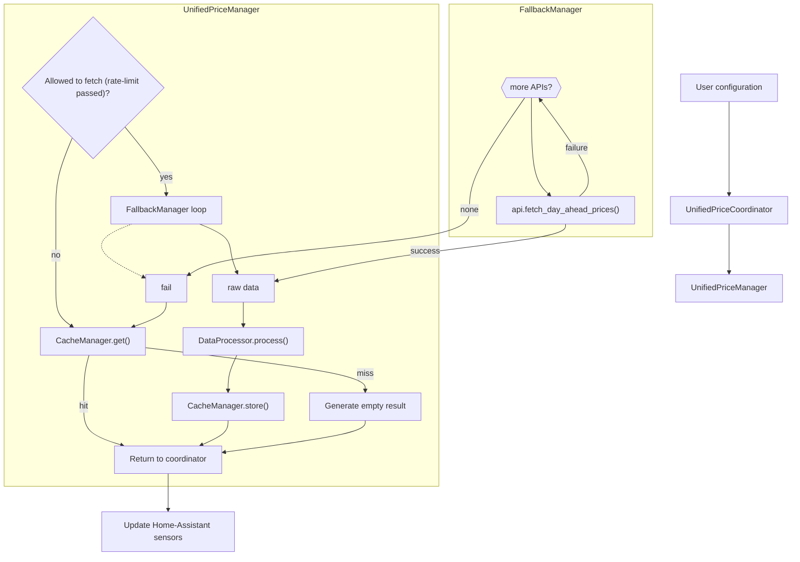
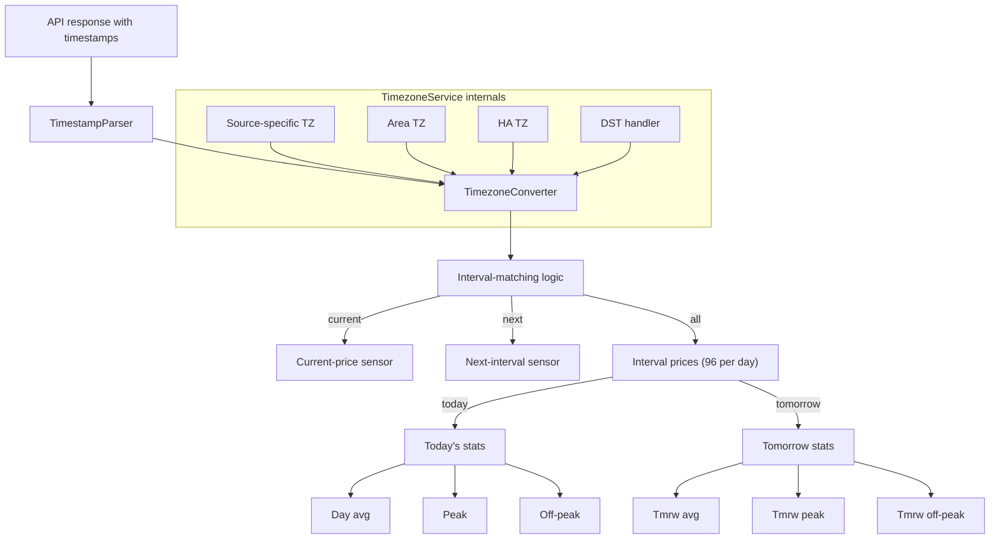
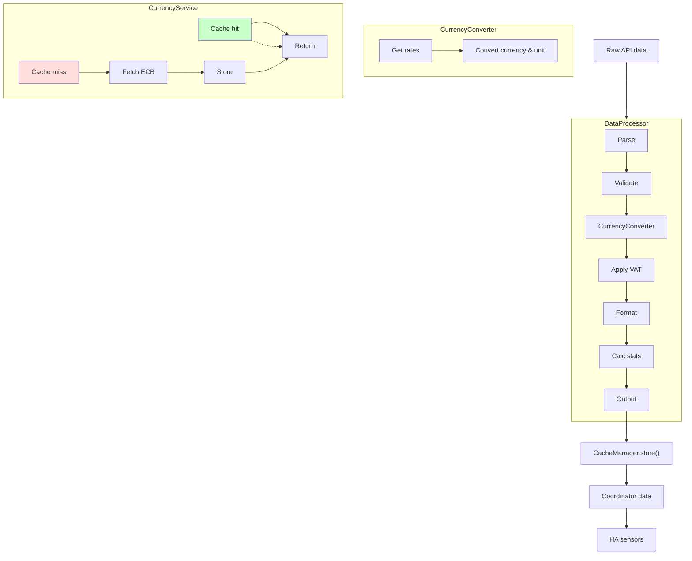
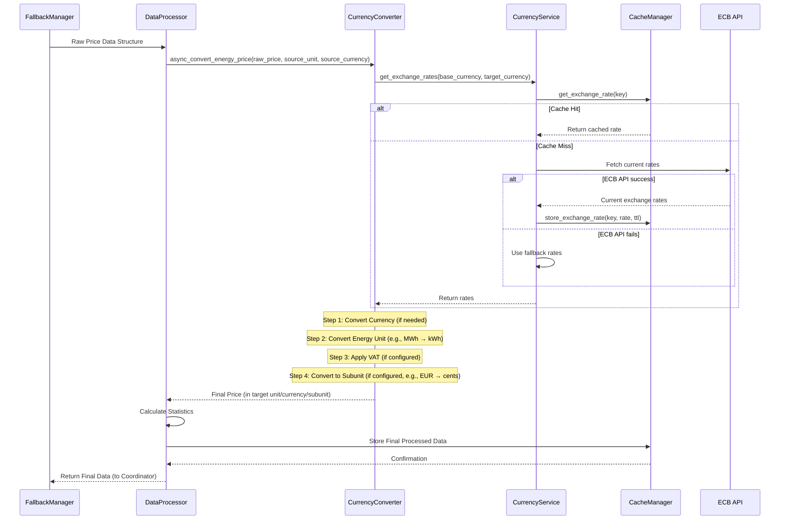
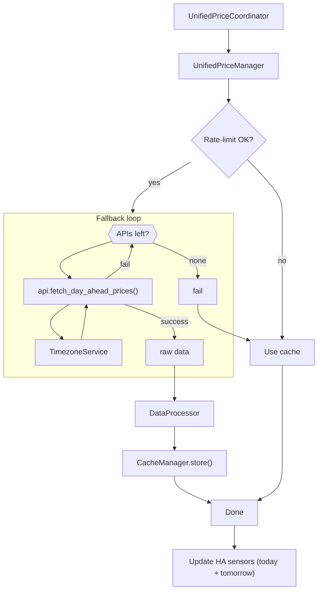

# GE-Spot: Global Electricity Spot Prices Integration for Home Assistant

 

> *"Hit the right spot with your energy prices"*


This custom integration allows you to fetch day-ahead electricity spot prices from various trustworthy global sources for use in automations, dashboards, and energy monitoring within Home Assistant.

## Table of Contents

- [Installation](#installation)
- [Supported Price Sources & Regions](#supported-price-sources--regions)
- [Features](#features)
- [Configuration](#configuration)
- [Technical Features](#technical-features)
  - [Multi-Source API & Fallback System](#multi-source-api--fallback-system)
  - [Timezone Handling](#timezone-handling)
  - [Price Conversion Logic](#price-conversion-logic)
  - [Currency Conversion](#currency-conversion)
  - [Price Differences Between Sources](#price-differences-between-sources)
  - [Ensuring Consistent Hour Alignment](#ensuring-consistent-hour-alignment)
- [Usage Examples](#usage-examples)
- [Troubleshooting](#troubleshooting)
- [For Developers](#for-developers)

## Installation

### HACS Installation (Recommended)

1. Make sure [HACS](https://hacs.xyz/) is installed
2. Add this repository as a custom repository in HACS
3. Click "Add"
4. Search for "GE-Spot: Global Electricity Spot Prices"
5. Click Install
6. Restart Home Assistant

### Manual Installation

1. Copy the `ge_spot` directory from this repository to your Home Assistant's `custom_components` directory
2. Restart Home Assistant

## Supported Price Sources & Regions

The integration supports multiple price data sources with automatic fallback capabilities:

- **Nordpool** - Prices for Nordic and Baltic countries
- **Energi Data Service** - Prices for Denmark
- **Stromligning** - Prices for Denmark
- **ENTSO-E** - European Network of Transmission System Operators for Electricity (requires API key)
- **OMIE** - Iberian Electricity Market Operator for Spain and Portugal
- **EPEX SPOT** - European Power Exchange for Central Europe **(WIP)**
- **AEMO** - Australian Energy Market Operator **(WIP)**
- **ComEd** - Commonwealth Edison hourly pricing for Chicago area (USA) **(WIP)**
- **Amber** - Amber Electric for Australia **(WIP - Not yet fully integrated/listed in matrix)**

### Region Support Matrix

The table below shows which price sources support specific regions:

| Region | Description | Nordpool | ENTSO-E | Energi Data | Stromligning | EPEX (WIP) | OMIE | AEMO (WIP) | ComEd (WIP) | Amber (WIP) |
|--------|-------------|:--------:|:-------:|:-----------:|:------------:|:----------:|:----:|:----------:|:-----------:|:-----------:|
| SE1    | Sweden North | ✓ | ✓ | | | | | | | |
| SE2    | Sweden North-Central | ✓ | ✓ | | | | | | | |
| SE3    | Sweden South-Central | ✓ | ✓ | | | | | | | |
| SE4    | Sweden South | ✓ | ✓ | | | | | | | |
| DK1    | Denmark West | ✓ | ✓ | ✓ | ✓ | | | | | |
| DK2    | Denmark East | ✓ | ✓ | ✓ | ✓ | | | | | |
| NO1-4  | Norway Areas | ✓ | ✓ | | | | | | | |
| FI     | Finland | ✓ | ✓ | | | | | | | |
| EE     | Estonia | ✓ | ✓ | | | | | | | |
| LV     | Latvia | ✓ | | | | | | | | |
| LT     | Lithuania | ✓ | | | | | | | | |
| DE     | Germany | | ✓ | | | ✓ | | | | |
| FR     | France | | ✓ | | | ✓ | | | | |
| NL     | Netherlands | | ✓ | | | ✓ | | | | |
| BE     | Belgium | | ✓ | | | ✓ | | | | |
| AT     | Austria | | ✓ | | | ✓ | | | | |
| ES     | Spain | | ✓ | | | | ✓ | | | |
| PT     | Portugal | | ✓ | | | | ✓ | | | |
| NSW1   | Australia NSW | | | | | | | ✓ | | ✓ |
| QLD1   | Australia Queensland | | | | | | | ✓ | | ✓ |
| SA1    | Australia South | | | | | | | ✓ | | ✓ |
| TAS1   | Australia Tasmania | | | | | | | ✓ | | ✓ |
| VIC1   | Australia Victoria | | | | | | | ✓ | | ✓ |
| US-IL  | Chicago Area | | | | | | | | ✓ | |

For a complete list of supported areas and their currency mappings, see the [Const files](custom_components/ge_spot/const/areas.py) in the codebase.

## Features

- Simple configuration through the Home Assistant UI
- Region-specific setup options
- **15-minute price intervals** for accurate, granular pricing (96 intervals per day)
- Source-agnostic sensors that provide consistent entity IDs regardless of data source
- Tomorrow's prices available after 13:00 CET (when published)
- Automatic fallback between data sources for the same region for increased reliability
- Seamless timezone handling to ensure correct interval price display regardless of API source
- Currency conversion with dynamic exchange rates from the European Central Bank
- Timestamps in ISO format for compatibility with other systems
- Provides the following sensors for each configured region:
  - **Current Price:** The electricity spot price for the current 15-minute interval in your chosen display unit (e.g., cents/kWh).
  - **Next Interval Price:** The electricity spot price for the upcoming 15-minute interval.
  - **Average Price:** The average electricity spot price calculated across all intervals of the current day (today).
  - **Peak Price:** The highest interval electricity spot price encountered during the current day (today).
  - **Off-Peak Price:** The lowest interval electricity spot price encountered during the current day (today).
  - **Price Difference:** The absolute difference between the *Current Price* and the *Average Price* for today. A negative value indicates the current price is below the daily average.
  - **Price Percentage:** The relative difference between the *Current Price* and the *Average Price* for today, expressed as a percentage of the average price. A negative percentage indicates the current price is below the daily average.
  - **Tomorrow Average Price:** The average electricity spot price calculated across all intervals of the *next* day (tomorrow). This sensor becomes available once tomorrow's prices are published by the source (typically around 13:00-14:00 CET).
  - **Tomorrow Peak Price:** The highest interval electricity spot price forecast for the *next* day (tomorrow). Becomes available when tomorrow's prices are published.
  - **Tomorrow Off-Peak Price:** The lowest interval electricity spot price forecast for the *next* day (tomorrow). Becomes available when tomorrow's prices are published.

## Configuration

After installation:

1. Go to Configuration → Integrations
2. Click "Add Integration" and search for "GE-Spot: Global Electricity Spot Prices"
3. Select your region/area from the dropdown
4. Configure settings:

### Basic Settings

- **Region/Area**: Select your electricity price area (e.g., SE4, DK1)
- **Source Priority**: Order of data sources to try (first = highest priority)
- **VAT Rate**: Set your applicable VAT percentage (e.g., 25 for 25%)
- **Update Interval**: How often to refresh data (15, 30, or 60 minutes)

### Advanced Settings

- **Display Format**: Choose between decimal (e.g., 0.15 EUR/kWh) or subunit (e.g., 15 cents/kWh)
- **API Keys**: For ENTSO-E, you'll need to [register for an API key](https://transparency.entsoe.eu/content/static_content/Static%20content/web%20api/Guide.html)
- **API Key Reuse**: The integration will reuse API keys across different regions using the same source

### VAT Handling

The integration handles VAT correctly based on your configuration:
- Enter VAT as a percentage (e.g., 25 for 25%)
- VAT is applied to the converted price after any currency conversion
- Some sources like Stromligning already include VAT in their prices

### Error Recovery and Rate Limiting

The integration implements several mechanisms to ensure reliability:

- **Automatic Retries**: Failed API requests are retried with exponential backoff
- **Source Fallbacks**: If the primary source fails, alternative sources are tried automatically
- **Data Caching**: Successfully fetched data is cached and used if all API sources fail
- **Rate Limiting**: Minimum update interval of 15 minutes to respect API rate limits
- **Special Update Windows**: More frequent updates during price publication times (around 13:00 CET)

## Technical Features

### Multi-Source API & Fallback System

GE-Spot uses a robust multi-source approach to ensure reliable price data:



### Timezone Handling

The integration normalizes timestamps from different APIs to ensure correct interval prices:



- **Timezone Awareness**: Handles UTC, local time, and timezone-naive timestamps correctly
- **Region-specific Handling**: Applies appropriate timezone for each price area
- **Home Assistant Integration**: Uses your Home Assistant timezone setting for consistent display
- **15-Minute Intervals**: All timestamps are normalized to 15-minute boundaries (HH:00, HH:15, HH:30, HH:45)

### Price Conversion Logic

The integration implements a comprehensive price conversion system that ensures accurate pricing across all regions and currencies:



The price conversion follows this detailed process:



### Currency Conversion

GE-Spot makes currency conversion simple and reliable:

- **Automatic Currency Detection**: Appropriate currency selected based on region
- **Dynamic Exchange Rates**: Fresh rates from the European Central Bank
- **Smart Caching**: Exchange rates are cached for 24 hours to reduce API calls
- **Scheduled Updates**: Exchange rates are refreshed at 00:00, 06:00, 12:00, and 18:00
- **Fallback Rates**: Works even during network outages using cached values
- **Display Flexibility**: Show prices in main units (EUR/kWh) or subunits (cents/kWh, öre/kWh)

For example, converting from 69.16 EUR/MWh to öre/kWh for SE4 (with exchange rate 10.72):
1. EUR to SEK: 69.16 × 10.72 = 741.40 SEK/MWh
2. MWh to kWh: 741.40 ÷ 1000 = 0.7414 SEK/kWh
3. Apply VAT (if any): 0.7414 × (1 + VAT rate)
4. SEK to öre (if requested): 0.7414 × 100 = 74.14 öre/kWh

### Price Differences Between Sources

Different data sources will return different prices for the same hour due to what they include:

| Source | Price Components | Notes |
|--------|------------------|-------|
| Energi Data Service/ENTSO-E | Raw spot price | Base wholesale electricity market price |
| Nordpool | Raw spot price | May differ slightly due to timing/rounding |
| Stromligning | Spot price + grid fees + tariffs + taxes | Full consumer electricity price |
| ComEd (WIP) | Hourly real-time pricing | 5-minute and hourly average options |
| EPEX (WIP) | Raw spot price | Similar to ENTSO-E |
| OMIE | Raw spot price | Similar to ENTSO-E |
| AEMO (WIP) | Raw spot price | Australian market specifics |
| Amber (WIP) | Spot price + network fees + carbon costs | Includes additional components |

For Danish areas (DK1, DK2), the integration extracts only the electricity component from Stromligning to match other price sources. The full price breakdown with all components is available in the sensor attributes.

### Ensuring Consistent Interval Alignment

To ensure all sources report prices for the same time intervals despite different source timezones:

1. Each API response is processed with explicit timezone awareness
2. Timestamps are parsed in their original timezone context
3. Intervals are normalized to the Home Assistant timezone
4. DST transitions are handled automatically (92 intervals on spring-forward days, 100 on fall-back days)
5. All prices are aligned to 15-minute boundaries: HH:00, HH:15, HH:30, HH:45

This ensures that, for example, the price for 14:15 is the same regardless of which API provided it.

### API Data Resolution & Expansion

Different APIs provide data at different intervals. GE-Spot intelligently handles this:

| Source | Native Resolution | How GE-Spot Handles It |
|--------|-------------------|------------------------|
| **ENTSO-E** | 15-min (PT15M), 30-min (PT30M), or hourly (PT60M) | Uses native 15-min data when available |
| **Nord Pool** | Transitioning to 15-min | Detects actual resolution; expands if hourly |
| **EPEX** | 15-min products | Uses native 15-min data |
| **OMIE** | Hourly only | Expands hourly data to 15-min intervals (duplicates price) |
| **ComEd** | 5-min dispatch | Aggregates 5-min data to 15-min intervals (averages 3 values) |
| **Stromligning** | Hourly | Expands hourly data to 15-min intervals |
| **Energi Data** | Hourly | Expands hourly data to 15-min intervals |
| **Amber** | 30-min (NEM) | Accepts 30-min intervals; may expand to 15-min |
| **AEMO** | 5-min dispatch | Aggregates 5-min data to 15-min intervals |

**Expansion Strategy**: For hourly-only APIs, each hour's price is duplicated across all 4 intervals within that hour. For example:
- Input: `{"14:00": 50.0 EUR/MWh, "15:00": 55.0 EUR/MWh}`
- Output: `{"14:00": 50.0, "14:15": 50.0, "14:30": 50.0, "14:45": 50.0, "15:00": 55.0, "15:15": 55.0, "15:30": 55.0, "15:45": 55.0}`

This approach maintains compatibility with all API sources while providing consistent 15-minute granularity for automations.

### Tomorrow's Data Fetching

The integration implements a sophisticated system for fetching tomorrow's electricity prices:



## Usage Examples

### Basic Dashboard Card

```yaml
type: entities
entities:
  - entity: sensor.gespot_current_price_se4
    name: Current Electricity Price (15-min interval)
  - entity: sensor.gespot_next_interval_price_se4
    name: Next Interval Price
  - entity: sensor.gespot_day_average_price_se4
    name: Today's Average
  - entity: sensor.gespot_tomorrow_average_price_se4
    name: Tomorrow's Average
```

### Price Graph Card


```yaml
type: custom:apexcharts-card
now:
  show: true
  label: ""
graph_span: 2d
span:
  start: day
apex_config:
  chart:
    height: 300px
  legend:
    show: false
  xaxis:
    labels:
      format: HH:mm
  grid:
    borderColor: "#e0e0e0"
    strokeDashArray: 3
  tooltip:
    x:
      format: HH:mm
  annotations:
    yaxis:
      - "y": 0
        yAxisIndex: 0
        strokeDashArray: 0
        borderColor: rgba(128, 128, 128, 0.8)
        borderWidth: 2
        opacity: 1
yaxis:
  - id: watts
    decimals: 0
  - id: price
    decimals: 0
    opposite: true
experimental:
  color_threshold: true
series:
  - entity: sensor.gespot_current_price_se4
    name: Price (öre)
    type: area
    curve: stepline
    yaxis_id: price
    extend_to: now
    stroke_width: 0
    opacity: 0.7
    data_generator: |
      const timeToTimestamp = (time, offset = 0) => {
        const [h, m] = time.split(':');
        const d = new Date();
        d.setHours(h, m, 0, 0);
        offset && d.setDate(d.getDate() + offset);
        return d;
      };
      return [
        ...Object.entries(entity.attributes.today_with_timestamps || {}).map(([t, v]) => [timeToTimestamp(t), v]),
        ...Object.entries(entity.attributes.tomorrow_with_timestamps || {}).map(([t, v]) => [timeToTimestamp(t, 1), v])
      ].sort((a, b) => a[0] - b[0]);
    color_threshold:
      - value: -50
        color: cyan
      - value: 0
        color: green
      - value: 40
        color: orange
      - value: 100
        color: red
      - value: 200
        color: magenta
      - value: 500
        color: black
  - entity: sensor.YOUR_ENERGY_METER
    name: Watts
    type: line
    curve: smooth
    yaxis_id: watts
    color: "#FF0000"
    stroke_width: 2
    opacity: 0.5
    extend_to: false
    group_by:
      func: avg
      duration: 5min
update_interval: 300s
```

### Price-Based Automation

```yaml
automation:
  - alias: Turn on water heater when prices are low
    trigger:
      - platform: state
        entity_id: sensor.gespot_current_price_se4
    condition:
      - condition: template
        value_template: "{{ states('sensor.gespot_current_price_se4')|float < states('sensor.gespot_day_average_price_se4')|float * 0.8 }}"
    action:
      - service: switch.turn_on
        entity_id: switch.water_heater
```

### Energy Dashboard Integration

To integrate GE-Spot with the Energy Dashboard, you can create template sensors:

```yaml
template:
  - sensor:
      - name: "Energy Cost Sensor"
        unit_of_measurement: "SEK/kWh"
        state: "{{ states('sensor.gespot_current_price_se4') }}"
```

Then set this sensor as your energy cost sensor in the Energy Dashboard settings.

## Troubleshooting

If you experience issues:

### Common Problems

- **No Data/Empty Sensors**: Check if your area is correctly supported by your selected source
- **API Key Errors**: For ENTSO-E, verify your API key is entered correctly
- **Timezone Issues**: Check if the interval prices align with your expected times
- **Missing Tomorrow Prices**: Tomorrow's prices are typically only available after 13:00 CET
- **Sensor Shows 96 Data Points**: This is correct! GE-Spot now provides 15-minute intervals (96 per day instead of 24 hourly)

### Diagnostic Steps

1. Check sensor attributes for detailed information:
   - `data_source`: Which API provided the data
   - `active_source`: Current active source being used
   - `fallback_sources`: Alternative sources that succeeded
   - `attempted_sources`: All sources that were tried
   - `using_cached_data`: Whether cached data is being used

2. Check Home Assistant logs for errors related to `ge_spot`

3. Verify network connectivity to the API endpoints

4. Try increasing the update interval if you experience frequent timeouts

### Improving Reliability

- Configure multiple sources in your priority list
- Get an ENTSO-E API key for better fallback options
- Use longer update intervals (30 or 60 minutes)
- Check if your internet connection is stable

## For Developers

GE-Spot follows a modular architecture with clear separation of concerns:

```
custom_components/ge_spot/
├── __init__.py           # Integration setup
├── config_flow.py        # Configuration flow handler
├── manifest.json         # Integration manifest
├── api/                  # API clients for different price sources
│   ├── __init__.py
│   ├── base/             # Base classes for API functionality (adapter, fetcher, error handler)
│   ├── parsers/          # Dedicated parsers for each API source
│   └── [source_name].py  # Specific API client implementations (e.g., nordpool.py)
├── config_flow/          # UI Configuration flow logic
│   ├── __init__.py
│   ├── implementation.py # Main config flow steps
│   ├── options.py        # Options flow handler
│   ├── schemas.py        # Voluptuous schemas for validation
│   └── validators.py     # Custom validators
├── const/                # Constants (areas, sources, currencies, defaults, etc.)
├── coordinator/          # Data coordination and management
│   ├── __init__.py
│   ├── unified_price_manager.py # Orchestrates fetching, processing, caching
│   ├── fallback_manager.py    # Handles trying sources in priority order
│   ├── data_processor.py      # Processes raw data (timezone, currency, stats)
│   ├── cache_manager.py       # Manages data caching
│   └── api_key_manager.py     # Manages API keys
├── price/                # Price data processing and conversion
│   ├── __init__.py
│   ├── currency_converter.py  # Handles currency/unit conversion
│   ├── currency_service.py    # Manages exchange rate fetching/caching
│   └── statistics.py        # Calculates price statistics (avg, peak, etc.)
├── sensor/               # Sensor entity implementations
│   ├── __init__.py
│   ├── base.py           # Base sensor class
│   ├── electricity.py    # Main electricity price sensor logic
│   └── price.py          # Specific price sensor types (current, avg, etc.)
├── timezone/             # Timezone handling and conversion
│   ├── __init__.py
│   ├── service.py        # Main timezone service
│   └── ...               # Helper modules for parsing, DST, etc.
├── translations/         # UI translation strings
└── utils/                # Utility functions and classes
    ├── __init__.py
    ├── advanced_cache.py # Advanced caching implementation
    ├── data_validator.py # Data validation helpers
    ├── exchange_service.py # Fetches/caches ECB exchange rates
    ├── rate_limiter.py   # Handles API rate limiting
    └── ...               # Other utilities (date range, unit conversion, etc.)
```

### API System

The API system is designed to be extensible and fault-tolerant:

1.  **Modular Adapters**: Each price source is implemented as a separate module in `custom_components/ge_spot/api/`, often inheriting from a base adapter in `api/base/`.
2.  **Source Prioritization**: During configuration, users define the order in which API sources should be tried for their selected region.
3.  **Fallback Mechanism**: The `FallbackManager` iterates through the prioritized list of adapters for a region, attempting to fetch data until one succeeds.
4.  **Data Validation**: Parsed data undergoes validation (e.g., using `utils/data_validator.py`) before further processing.
5.  **Error Handling**: Base API classes and the fetching process include error handling, logging, and retry logic (often with backoff).

### Adding a New Price Source

To add a new price source:

1.  Create a new API client module in `custom_components/ge_spot/api/` (e.g., `my_new_source.py`).
2.  Implement the client logic, ideally inheriting from `api.base.BasePriceAPI` or a similar base class. This typically involves implementing methods like `fetch_raw_data` and potentially `parse_raw_data` (or creating a separate parser).
3.  If needed, create a dedicated parser in `custom_components/ge_spot/api/parsers/`.
4.  Register the new source:
    *   Add a constant for the source name in `const/sources.py`.
    *   Map the source to its implementation class in `api/__init__.py` (in the `SOURCE_MAP`).
    *   Define which regions the source supports in `const/api.py` (in `SOURCE_REGION_SUPPORT`).
5.  Add any relevant region/area codes and currency mappings in `const/areas.py`.
6.  Update the configuration flow (`config_flow/schemas.py`, `config_flow/implementation.py`) to allow users to select the new source in the priority list if applicable for their region.
7.  Add tests for the new API client and parser.

### Standardized Return Format

API parsers aim to return a standardized dictionary format containing raw interval prices, timezone, and currency information. This raw structure is then processed by the `DataProcessor` into the final format used by sensors, which typically includes:

```python
{
    "current_price": float,           # Current interval price (converted)
    "next_interval_price": float,     # Next interval price (converted)
    "day_average_price": float,       # Day average (converted)
    "peak_price": float,              # Day maximum (converted)
    "off_peak_price": float,          # Day minimum (converted)
    "interval_prices": dict,          # Interval prices "YYYY-MM-DDTHH:MM:00+ZZ:ZZ" -> float (converted)
                                      # 96 entries for a full day (15-min intervals)
    "tomorrow_interval_prices": dict, # Tomorrow's interval prices (if available, converted)
    "raw_today": dict,                # Raw interval prices for today (before conversion)
    "raw_tomorrow": dict,             # Raw interval prices for tomorrow (before conversion)
    "source_data": {                  # Metadata about the fetch
        "source": str,                # Source name that provided the data
        "currency": str,              # Original currency from source
        "timezone": str,              # Original timezone from source
        # ... other source-specific details
    },
    "conversion_details": {           # Details about the conversion process
        "target_currency": str,
        "target_unit": str,
        "vat_rate": float,
        "exchange_rate": float,
        # ...
    },
    "last_updated": str,              # ISO timestamp of the update
    # ... other calculated attributes
}
```
*Note: The exact structure might vary slightly; check `DataProcessor` and sensor attributes for the precise format.*

### Error Handling System

The error handling system provides:

1.  **Error Classification**: Specific exceptions are often defined (e.g., in `api/base/exceptions.py`) and raised by API clients.
2.  **Error Recovery**: The `FallbackManager` and underlying fetch mechanisms often include retries (sometimes with exponential backoff) for transient network or API errors.
3.  **Logging**: Errors during fetching or processing are logged to Home Assistant logs for diagnostics.
4.  **Fallback to Cache**: If all sources fail, the system attempts to use previously cached data.

### Fallback System

The fallback system ensures reliability:

1.  **Prioritized List**: Uses the user-configured source priority list for the region.
2.  **Sequential Attempts**: The `FallbackManager` tries fetching from each source in order.
3.  **First Success Wins**: Uses the data from the first source in the list that returns valid data.
4.  **Caching**: If all sources in the priority list fail, it falls back to using cached data if available and not expired.
5.  **Status Tracking**: Sensor attributes often indicate which source succeeded (`data_source`), which were tried (`attempted_sources`), and if cache was used (`using_cached_data`).

### Testing

The integration includes automated tests using `pytest` and manual test scripts.

#### Automated Tests (pytest)

Located in `tests/pytest/`. Organized into `unit`, `integration`, and `lib` tests.

To run all pytest tests:
```bash
pytest tests/pytest/
```

To run specific categories (e.g., unit tests):
```bash
pytest tests/pytest/unit/
```

(Refer to `tests/README.md` for more details on pytest structure and execution).

#### Manual Tests

Located in `tests/manual/`. These scripts often test against live APIs (API keys might be required via environment variables).

Example: Run a specific manual integration test:
```bash
python -m tests/manual.integration.nordpool_full_chain SE4
```

(Refer to `tests/README.md` and individual script headers for usage instructions).

### Performance Optimization

The integration includes several performance optimizations:

1.  **Asynchronous Operations**: Uses `asyncio` and `httpx.AsyncClient` for non-blocking I/O during API calls.
2.  **Source Prioritization**: Avoids calling lower-priority sources if a higher-priority one succeeds quickly.
3.  **Advanced Caching**: Caches processed data (`CacheManager`) and exchange rates (`ExchangeService`) with configurable TTLs to reduce redundant computations and API calls.
4.  **Rate Limiting**: Implements rate limiting (`utils/rate_limiter.py`) to avoid overwhelming APIs and respect usage limits, especially during frequent update checks.
5.  **Parallel Fetching (Potential)**: While `utils/parallel_fetcher.py` exists, verify its current usage in the main fetch flow. This was a planned refactoring which never went live due to it's complexity.

## License

This integration is licensed under the MIT License.
