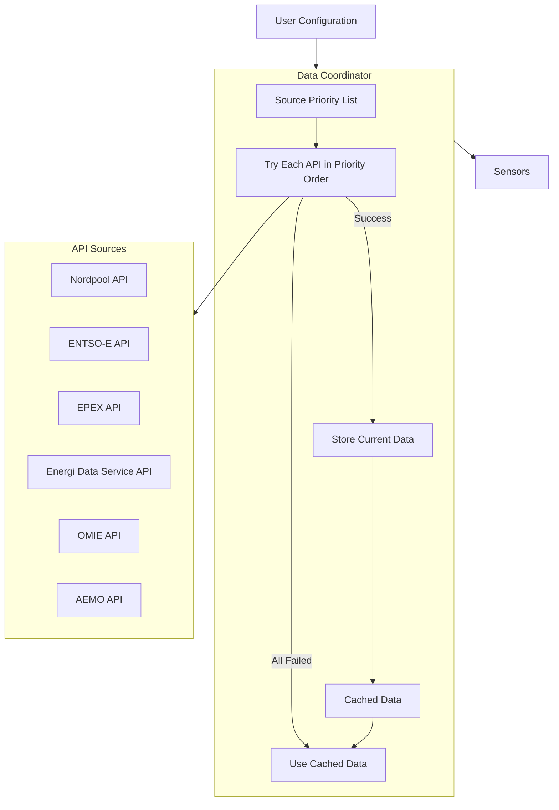
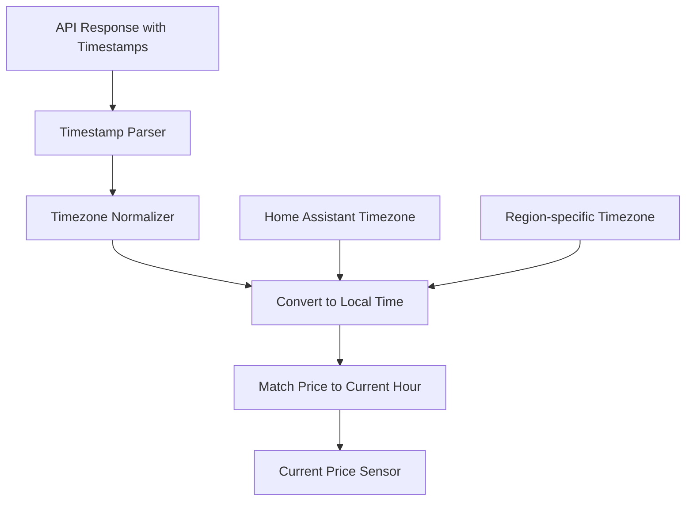
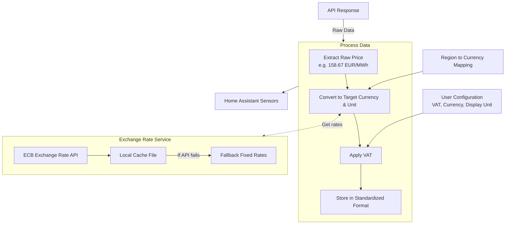
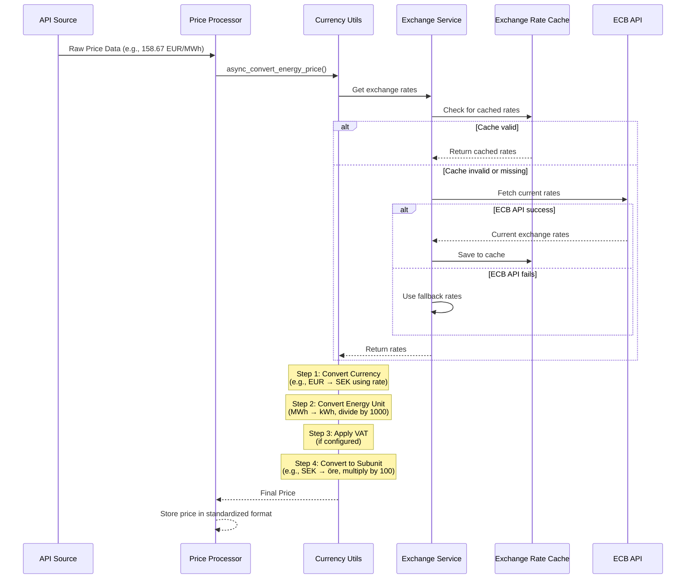
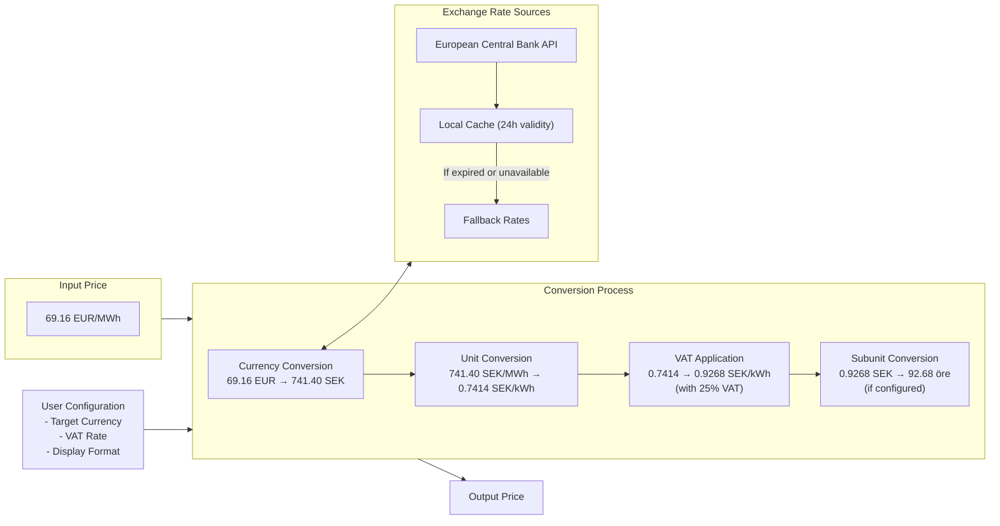

# GE-Spot: Global Electricity Spot Prices Integration for Home Assistant

> *"Hit the right spot with your energy prices"*

This custom integration allows you to fetch day-ahead electricity spot prices from various trustworthy global sources for use in automations, dashboards, and energy monitoring within Home Assistant.

## Supported Price Sources

- **Nordpool** (🔥 Recommended) - Prices for Nordic and Baltic countries
- **Energi Data Service** - Prices for Denmark
- **ENTSO-E** - European Network of Transmission System Operators for Electricity (requires API key)
- **EPEX SPOT** - European Power Exchange for Central Europe
- **OMIE** - Iberian Electricity Market Operator for Spain and Portugal
- **AEMO** - Australian Energy Market Operator

## Features

- Simple configuration through the Home Assistant UI
- Region-specific setup options
- Source-agnostic sensors that provide consistent entity IDs regardless of data source
- Tomorrow's prices available after 13:00 CET (when published)
- Automatic fallback between data sources for the same region for increased reliability
- Seamless timezone handling to ensure correct hourly price display regardless of API source
- Currency conversion with dynamic exchange rates from the European Central Bank
- Timestamps in ISO format for compatibility with other systems
- Eight sensor types for each configured region:
  - Current hour price
  - Next hour price
  - Day average price
  - Peak price (highest of the day)
  - Off-peak price (lowest of the day)
  - Tomorrow average price
  - Tomorrow peak price (highest of tomorrow)
  - Tomorrow off-peak price (lowest of tomorrow)

## Multi-Source API & Fallback System

GE-Spot uses a robust multi-source approach to ensure reliable price data:


```mermaid
flowchart TD
    Config[User Configuration] --> Coordinator
    
    subgraph Coordinator["Data Coordinator"]
        Priority[Source Priority List]
        FetchLoop["Try Each API in Priority Order"]
        Cache["Cached Data"]
        
        Priority --> FetchLoop
        FetchLoop --> |Success| DataStore["Store Current Data"]
        FetchLoop --> |All Failed| Fallback["Use Cached Data"]
        Cache --> Fallback
        DataStore --> Cache
    end
    
    Coordinator --> Sensors

    subgraph APIGroup["API Sources"]
        Nordpool["Nordpool API"]
        ENTSOE["ENTSO-E API"]
        EPEX["EPEX API"]
        EDS["Energi Data Service API"]
        OMIE["OMIE API"]
        AEMO["AEMO API"]
    end
    
    FetchLoop --> APIGroup
```

- **Source Prioritization**: You control the order in which APIs are tried
- **Automatic Fallback**: If the primary source fails, the system tries alternative sources automatically
- **Transparent Attribution**: Sensor attributes show which API provided the data
- **Data Caching**: Previously fetched data serves as a last-resort fallback if all APIs fail

## Timezone Handling

The integration normalizes timestamps from different APIs to ensure correct hourly prices:


```mermaid
flowchart TD
    API["API Response with Timestamps"] --> Parser["Timestamp Parser"]
    Parser --> Normalizer["Timezone Normalizer"]
    Normalizer --> Converter["Convert to Local Time"]
    HAConfig["Home Assistant Timezone"] --> Converter
    AreaTZ["Region-specific Timezone"] --> Converter
    Converter --> Matcher["Match Price to Current Hour"]
    Matcher --> Sensor["Current Price Sensor"]
```

- **Timezone Awareness**: Handles UTC, local time, and timezone-naive timestamps correctly
- **Region-specific Handling**: Applies appropriate timezone for each price area
- **Home Assistant Integration**: Uses your Home Assistant timezone setting for consistent display

## Price Conversion Logic

The integration implements a comprehensive price conversion system that ensures accurate pricing across all regions and currencies:


```mermaid
flowchart TD
    API[API Response] -->|Raw Data| Process
    
    subgraph Process["Process Data"]
        Extract[Extract Raw Price\ne.g. 158.67 EUR/MWh]
        Convert[Convert to Target Currency & Unit]
        Apply[Apply VAT]
        Store[Store in Standardized Format]
        
        Extract --> Convert
        Convert --> Apply
        Apply --> Store
    end
    
    Process --> Sensors[Home Assistant Sensors]
    
    subgraph Exchange["Exchange Rate Service"]
        ECB[ECB Exchange Rate API]
        Cache[Local Cache File]
        Fallback[Fallback Fixed Rates]
        
        ECB --> Cache
        Cache --> |If API fails| Fallback
    end
    
    Convert <-.->|Get rates| Exchange
    
    Config[User Configuration\nVAT, Currency, Display Unit] --> Apply
    RegionMap[Region to Currency Mapping] --> Convert
```

The price conversion follows this detailed process:


```mermaid
sequenceDiagram
    participant API as API Source
    participant Processor as Price Processor
    participant Converter as Currency Utils
    participant Exchange as Exchange Service
    participant Cache as Exchange Rate Cache
    participant ECB as ECB API
    
    API->>Processor: Raw Price Data (e.g., 158.67 EUR/MWh)
    
    Processor->>Converter: async_convert_energy_price()
    
    Converter->>Exchange: Get exchange rates
    Exchange->>Cache: Check for cached rates
    
    alt Cache valid
        Cache-->>Exchange: Return cached rates
    else Cache invalid or missing
        Exchange->>ECB: Fetch current rates
        
        alt ECB API success
            ECB-->>Exchange: Current exchange rates
            Exchange->>Cache: Save to cache
        else ECB API fails
            Exchange->>Exchange: Use fallback rates
        end
        
        Exchange-->>Converter: Return rates
    end
    
    Note over Converter: Step 1: Convert Currency<br>(e.g., EUR → SEK using rate)
    Note over Converter: Step 2: Convert Energy Unit<br>(MWh → kWh, divide by 1000)
    Note over Converter: Step 3: Apply VAT<br>(if configured)
    Note over Converter: Step 4: Convert to Subunit<br>(e.g., SEK → öre, multiply by 100)
    
    Converter-->>Processor: Final Price
    Processor-->>Processor: Store price in standardized format
```

For example, converting from 69.16 EUR/MWh to öre/kWh for SE4 (with exchange rate 10.72):
1. EUR to SEK: 69.16 × 10.72 = 741.40 SEK/MWh
2. MWh to kWh: 741.40 ÷ 1000 = 0.7414 SEK/kWh
3. Apply VAT (if any): 0.7414 × (1 + VAT rate)
4. SEK to öre (if requested): 0.7414 × 100 = 74.14 öre/kWh

## Installation

### HACS Installation (Recommended)

1. Make sure [HACS](https://hacs.xyz/) is installed
2. Add this repository as a custom repository in HACS
3. Click "Add"
4. Search for "GE-Spot: Global Electricity Spot Prices"
5. Click Install
6. Restart Home Assistant

### Manual Installation

1. Copy the `ge_spot` directory from this repository to your Home Assistant's `custom_components` directory
2. Restart Home Assistant

## Currency Conversion

GE-Spot makes currency conversion simple and reliable:


```mermaid
flowchart LR
    subgraph Input["Input Price"]
        RawPrice["69.16 EUR/MWh"]
    end
    
    subgraph Conversion["Conversion Process"]
        Currency["Currency Conversion\n69.16 EUR → 741.40 SEK"]
        Unit["Unit Conversion\n741.40 SEK/MWh → 0.7414 SEK/kWh"]
        VAT["VAT Application\n0.7414 → 0.9268 SEK/kWh\n(with 25% VAT)"]
        Subunit["Subunit Conversion\n0.9268 SEK → 92.68 öre\n(if configured)"]
        
        Currency --> Unit
        Unit --> VAT
        VAT --> Subunit
    end
    
    subgraph ExchangeRates["Exchange Rate Sources"]
        ECB["European Central Bank API"]
        Cache["Local Cache (24h validity)"]
        Fallback["Fallback Rates"]
        
        ECB --> Cache
        Cache --> |If expired or unavailable| Fallback
    end
    
    Input --> Conversion
    Currency <--> ExchangeRates
    Conversion --> Output["Output Price"]
    
    UserConfig["User Configuration\n- Target Currency\n- VAT Rate\n- Display Format"] --> Conversion
```

- **Automatic Currency Detection**: Appropriate currency selected based on region
- **Dynamic Exchange Rates**: Fresh rates from the European Central Bank
- **Smart Caching**: Reduces API calls while maintaining accuracy
- **Fallback Rates**: Works even during network outages
- **Display Flexibility**: Show prices in main units (EUR/kWh) or subunits (cents/kWh, öre/kWh)

## Setup & Configuration

After installation:

1. Go to Configuration → Integrations
2. Click "Add Integration" and search for "GE-Spot: Global Electricity Spot Prices"
3. Select your region/area
4. Configure your preferred source priority (the order used for fallbacks)
5. Set your preferred VAT rate and update interval
6. For ENTSO-E, you'll need to provide an API key when prompted
7. Choose display format (decimal or subunit like cents/öre)

## Usage Examples

### Current Price in a Dashboard

```yaml
type: entities
entities:
  - entity: sensor.gespot_current_price_se4
    name: Current Electricity Price
  - entity: sensor.gespot_next_hour_price_se4
    name: Next Hour Price
  - entity: sensor.gespot_day_average_price_se4
    name: Today's Average
  - entity: sensor.gespot_tomorrow_average_price_se4
    name: Tomorrow's Average
```

### Using Prices in Automations

```yaml
automation:
  - alias: Turn on water heater when prices are low
    trigger:
      - platform: state
        entity_id: sensor.gespot_current_price_se4
    condition:
      - condition: template
        value_template: "{{ states('sensor.gespot_current_price_se4')|float < states('sensor.gespot_day_average_price_se4')|float * 0.8 }}"
    action:
      - service: switch.turn_on
        entity_id: switch.water_heater
```

## Troubleshooting

If you experience issues:

- Check the Home Assistant logs for error messages related to `ge_spot`
- Verify that your selected region/area is correct
- For ENTSO-E, confirm your API key is entered correctly
- Try increasing the update interval if you're experiencing frequent timeouts
- Check sensor attributes to see if data is coming from a fallback source or cache

## Contributing

Contributions are welcome! Please feel free to submit a Pull Request.

## License

This integration is licensed under the MIT License.
