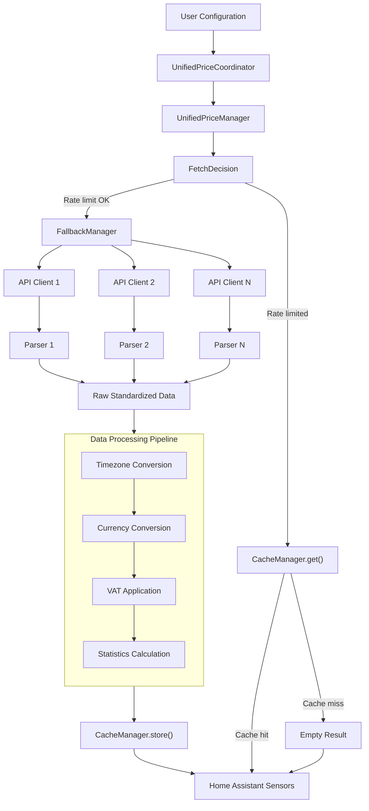
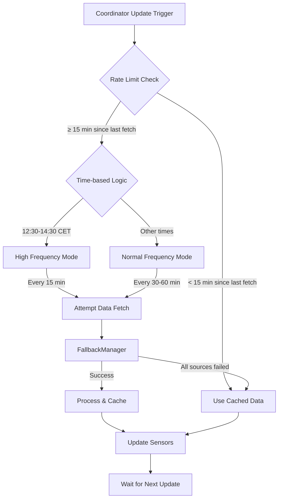
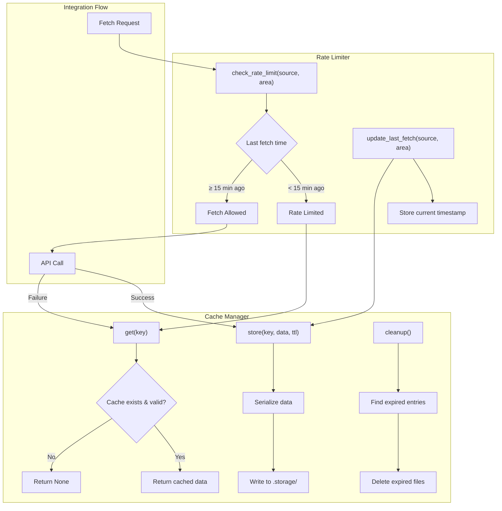
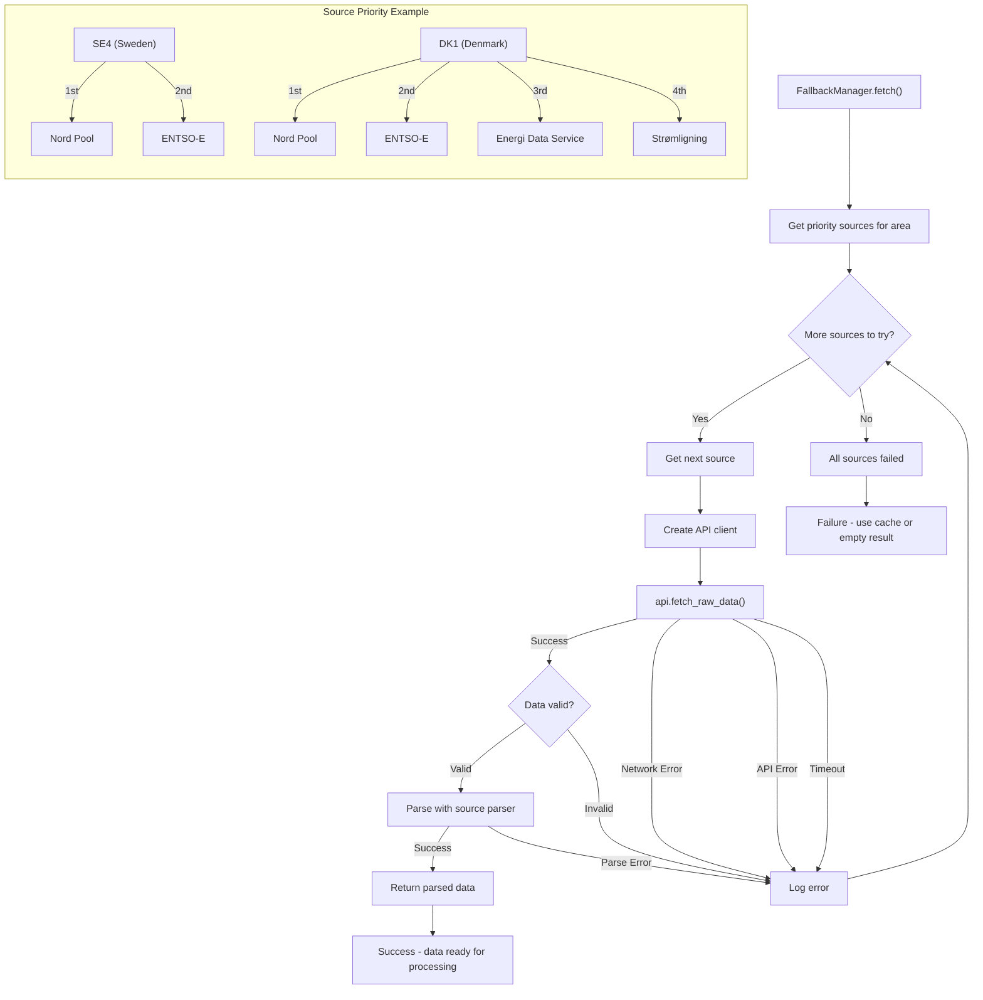

# GE-Spot: Global Electricity Spot Prices Integration for Home Assistant

 

> *"Hit the right spot with your energy prices"*


Home Assistant custom integration providing **electricity spot prices** from global markets with intelligent interval handling (15-minute, hourly, 5-minute) and automatic source fallback.

## Table of Contents

- [Installation](#installation)
- [Supported Price Sources & Regions](#supported-price-sources--regions)
- [Features](#features)
- [Configuration](#configuration)
- [Architecture](#architecture)
- [Usage Examples](#usage-examples)
- [Troubleshooting](#troubleshooting)
- [For Developers](#for-developers)
- [Technical Architecture (Advanced)](#technical-architecture-advanced)

## Installation

### HACS Installation (Recommended)

1. Make sure [HACS](https://hacs.xyz/) is installed
2. Add this repository as a custom repository in HACS
3. Click "Add"
4. Search for "GE-Spot: Global Electricity Spot Prices"
5. Click Install
6. Restart Home Assistant

### Manual Installation

1. Copy the `ge_spot` directory from this repository to your Home Assistant's `custom_components` directory
2. Restart Home Assistant

## Supported Price Sources & Regions

The integration supports multiple price data sources with automatic fallback capabilities:

- **Nordpool** - Nordic and Baltic countries
- **ENTSO-E** - European Network of Transmission System Operators (requires API key)
- **Energy-Charts** - European spot prices (Germany, France, Netherlands, Belgium, Austria, and more)
- **Energi Data Service** - Denmark
- **Stromligning** - Denmark  
- **OMIE** - Spain and Portugal
- **AEMO** - Australian Energy Market Operator
- **ComEd** - Chicago area real-time pricing
- **Amber** - Australian residential pricing

### Region Support Matrix

The table below shows which price sources support specific regions:

| Region | Description | Nordpool | ENTSO-E | Energy-Charts | Energi Data | Stromligning | OMIE | AEMO | ComEd | Amber |
|--------|-------------|:--------:|:-------:|:-------------:|:-----------:|:------------:|:----:|:----:|:-----:|:-----:|
| SE1-4  | Sweden | ✓ | ✓ | ✓ | | | | | | |
| DK1-2  | Denmark | ✓ | ✓ | ✓ | ✓ | ✓ | | | | |
| NO1-5  | Norway | ✓ | ✓ | ✓ | | | | | | |
| FI     | Finland | ✓ | ✓ | | | | | | | |
| EE     | Estonia | ✓ | ✓ | | | | | | | |
| LT     | Lithuania | ✓ | ✓ | | | | | | | |
| LV     | Latvia | ✓ | | | | | | | | |
| DE-LU  | Germany-Luxembourg | | ✓ | ✓ | | | | | | |
| FR     | France | | ✓ | ✓ | | | | | | |
| NL     | Netherlands | | ✓ | ✓ | | | | | | |
| BE     | Belgium | | ✓ | ✓ | | | | | | |
| AT     | Austria | | ✓ | ✓ | | | | | | |
| CH     | Switzerland | | ✓ | ✓ | | | | | | |
| PL     | Poland | | ✓ | ✓ | | | | | | |
| CZ     | Czech Republic | | ✓ | ✓ | | | | | | |
| HU     | Hungary | | ✓ | ✓ | | | | | | |
| SI     | Slovenia | | ✓ | ✓ | | | | | | |
| IT-North | Italy North | | ✓ | ✓ | | | | | | |
| ES     | Spain | | ✓ | | | | ✓ | | | |
| PT     | Portugal | | ✓ | | | | ✓ | | | |
| NSW1   | Australia NSW | | | | | | | ✓ | | ✓ |
| QLD1   | Australia Queensland | | | | | | | ✓ | | ✓ |
| SA1    | Australia South | | | | | | | ✓ | | ✓ |
| TAS1   | Australia Tasmania | | | | | | | ✓ | | ✓ |
| VIC1   | Australia Victoria | | | | | | | ✓ | | ✓ |
| ComEd  | Chicago Area | | | | | | | | ✓ | |

For complete area mappings, see [`const/areas.py`](custom_components/ge_spot/const/areas.py).

## Features

- **Flexible intervals** - Handles 15-min, hourly, and 5-min data from different markets
- **Unified output** - Standardizes to 15-minute intervals (96 data points per day)
- **Multi-source fallback** - Automatic switching between data sources
- **Global coverage** - Europe, Australia, and North America
- **Currency conversion** - Live ECB exchange rates
- **Timezone handling** - Consistent display regardless of API source
- **Tomorrow's prices** - Available after daily publication (typically 13:00 CET)

### Sensors Created (per region)

- **Current Price** - Current 15-minute interval price
- **Next Interval Price** - Upcoming interval price  
- **Average Price** - Today's average
- **Peak/Off-Peak Price** - Today's high/low
- **Price Difference** - Current vs average (absolute)
- **Price Percentage** - Current vs average (relative)
- **Tomorrow prices** - Average, peak, and off-peak forecasts

## Configuration

After installation:

1. Go to Configuration → Integrations
2. Click "Add Integration" and search for "GE-Spot: Global Electricity Spot Prices"
3. Select your region/area from the dropdown
4. Configure settings:

### Basic Settings

- **Region/Area**: Select your electricity price area (e.g., SE4, DK1)
- **Source Priority**: Order of data sources to try (first = highest priority)
- **VAT Rate**: Set your applicable VAT percentage (e.g., 25 for 25%)

### Advanced Settings

- **Display Format**: Choose between decimal (e.g., 0.15 EUR/kWh) or subunit (e.g., 15 cents/kWh)
- **API Keys**: For ENTSO-E, you'll need to [register for an API key](https://transparency.entsoe.eu/content/static_content/Static%20content/web%20api/Guide.html)
- **API Key Reuse**: The integration will reuse API keys across different regions using the same source

### Reliability Features

- **Rate limiting** - Minimum 15-minute intervals 
- **Automatic retries** - Exponential backoff for failed requests
- **Data caching** - Persistent storage with TTL
- **Source fallback** - Try all sources in priority order

## Architecture

**Data Flow:** API Client → Parser → Timezone Conversion → Currency Conversion → Cache → Sensors

**Three-Layer System:**
- **API Layer** - Source-specific clients (Nordpool, ENTSO-E, AEMO, etc.)
- **Coordinator Layer** - Unified manager with fallback and caching  
- **Sensor Layer** - Home Assistant entities with consistent IDs

### Timezone & Interval Handling

- **Source timezone detection** - Each API has known timezone behavior
- **DST transitions** - Handles 92-100 intervals on transition days  
- **15-minute alignment** - All data normalized to :00, :15, :30, :45 boundaries
- **Home Assistant integration** - Displays in your configured timezone

### Price Processing

**Conversion Pipeline:** Raw API Data → Currency Conversion → Unit Conversion → VAT Application → Display Formatting

**Currency handling:**
- Live ECB exchange rates (24h cache)
- Automatic currency detection by region
- Display in main units (EUR/kWh) or subunits (cents/kWh)

### Data Source Differences

Different sources include different price components:

| Source | Price Components |
|--------|------------------|
| Nordpool/ENTSO-E/OMIE | Raw spot price |
| Stromligning | Spot + grid fees + taxes (Denmark) |
| AEMO | Pre-dispatch trading prices (30-min intervals) |
| ComEd | Real-time market pricing (5-min dispatch) |
| Amber | Spot + network + carbon costs |

### Interval Resolution

GE-Spot intelligently handles different native resolutions from APIs:

| Source | Native Data | GE-Spot Processing |
|--------|-------------|-------------------|
| ENTSO-E | 15/30/60 min | Uses native 15-min when available, expands others |
| Nordpool | 15/60 min | Uses native 15-min, expands hourly to 15-min |
| Energy-Charts | 15 min | Uses native 15-min data (96 intervals/day) |
| OMIE/Stromligning | 60 min | Expands hourly to 15-min (duplicates across 4 intervals) |
| AEMO | 30 min trading | Expands to 15-min (duplicates across 2 intervals) |
| ComEd | 5 min dispatch | Aggregates to 15-min (averages 3 values per interval) |
| Amber | 30 min | Expands to 15-min (duplicates across 2 intervals) |

**Strategy**: All sources output 96 intervals per day (15-minute granularity) for consistent automation timing.

## Usage Examples

### Basic Dashboard Card

```yaml
type: entities
entities:
  - entity: sensor.gespot_current_price_se4
    name: Current Electricity Price (15-min interval)
  - entity: sensor.gespot_next_interval_price_se4
    name: Next Interval Price
  - entity: sensor.gespot_day_average_price_se4
    name: Today's Average
  - entity: sensor.gespot_tomorrow_average_price_se4
    name: Tomorrow's Average
```

### Price Graph Card


```yaml
type: custom:apexcharts-card
now:
  show: true
  label: ""
graph_span: 2d
span:
  start: day
apex_config:
  chart:
    height: 300px
  legend:
    show: false
  xaxis:
    labels:
      format: HH:mm
  grid:
    borderColor: "#e0e0e0"
    strokeDashArray: 3
  tooltip:
    x:
      format: HH:mm
  annotations:
    yaxis:
      - "y": 0
        yAxisIndex: 0
        strokeDashArray: 0
        borderColor: rgba(128, 128, 128, 0.8)
        borderWidth: 2
        opacity: 1
yaxis:
  - id: watts
    decimals: 0
  - id: price
    decimals: 0
    opposite: true
experimental:
  color_threshold: true
series:
  - entity: sensor.gespot_current_price_se4
    name: Price (öre)
    type: area
    curve: stepline
    yaxis_id: price
    extend_to: now
    stroke_width: 0
    opacity: 0.7
    data_generator: |
      const timeToTimestamp = (time, offset = 0) => {
        const [h, m] = time.split(':');
        const d = new Date();
        d.setHours(h, m, 0, 0);
        offset && d.setDate(d.getDate() + offset);
        return d;
      };
      return [
        ...Object.entries(entity.attributes.today_with_timestamps || {}).map(([t, v]) => [timeToTimestamp(t), v]),
        ...Object.entries(entity.attributes.tomorrow_with_timestamps || {}).map(([t, v]) => [timeToTimestamp(t, 1), v])
      ].sort((a, b) => a[0] - b[0]);
    color_threshold:
      - value: -50
        color: cyan
      - value: 0
        color: green
      - value: 40
        color: orange
      - value: 100
        color: red
      - value: 200
        color: magenta
      - value: 500
        color: black
  - entity: sensor.YOUR_ENERGY_METER
    name: Watts
    type: line
    curve: smooth
    yaxis_id: watts
    color: "#FF0000"
    stroke_width: 2
    opacity: 0.5
    extend_to: false
    group_by:
      func: avg
      duration: 5min
update_interval: 300s
```

### Price-Based Automation

```yaml
automation:
  - alias: Turn on water heater when prices are low
    trigger:
      - platform: state
        entity_id: sensor.gespot_current_price_se4
    condition:
      - condition: template
        value_template: "{{ states('sensor.gespot_current_price_se4')|float < states('sensor.gespot_day_average_price_se4')|float * 0.8 }}"
    action:
      - service: switch.turn_on
        entity_id: switch.water_heater
```

### Energy Dashboard Integration

To integrate GE-Spot with the Energy Dashboard, you can create template sensors:

```yaml
template:
  - sensor:
      - name: "Energy Cost Sensor"
        unit_of_measurement: "SEK/kWh"
        state: "{{ states('sensor.gespot_current_price_se4') }}"
```

Then set this sensor as your energy cost sensor in the Energy Dashboard settings.

## Troubleshooting

**Common Issues:**
- **No data** - Check area is supported by selected source
- **API key errors** - Verify ENTSO-E API key if using that source  
- **Missing tomorrow prices** - Available after 13:00 CET daily
- **96 data points** - Correct! 15-minute intervals = 96 per day

**Diagnostics:**
- Check sensor attributes: `data_source`, `active_source`, `using_cached_data`
- Review Home Assistant logs for `ge_spot` errors
- Configure multiple sources for better reliability

## For Developers

### Project Structure

```
custom_components/ge_spot/
├── __init__.py           # Integration setup and coordinator registration
├── config_flow.py        # Configuration flow handler
├── manifest.json         # Integration manifest and dependencies
├── api/                  # API clients for different price sources
│   ├── __init__.py       # API client factory and source mapping
│   ├── base/             # Base classes and shared functionality
│   │   ├── api_client.py       # HTTP client wrapper with retry logic
│   │   ├── base_price_api.py   # Abstract base for all price APIs
│   │   └── error_handler.py    # Error handling and retry mechanisms
│   ├── parsers/          # Data parsers for each API source
│   │   ├── nordpool_parser.py    # Nord Pool price data parser
│   │   ├── entsoe_parser.py      # ENTSO-E XML response parser
│   │   ├── aemo_parser.py        # AEMO market data parser
│   │   └── ...                   # Other source-specific parsers
│   ├── nordpool.py       # Nord Pool API client
│   ├── entsoe.py         # ENTSO-E API client
│   ├── energy_charts.py  # Energy-Charts API client
│   ├── aemo.py           # AEMO API client
│   ├── omie.py           # OMIE API client
│   ├── stromligning.py   # Strømligning API client
│   ├── energi_data.py    # Energi Data Service API client
│   ├── comed.py          # ComEd API client
│   ├── amber.py          # Amber Electric API client
│   └── utils.py          # API utility functions
├── config_flow/          # Configuration flow logic
│   ├── __init__.py       # Config flow exports
│   ├── implementation.py # Main configuration steps
│   ├── options.py        # Options flow for reconfiguration
│   ├── schemas.py        # Voluptuous schemas for validation
│   ├── utils.py          # Config flow utility functions
│   └── validators.py     # Custom validation logic
├── const/                # Constants and configuration
│   ├── __init__.py       # Constants exports
│   ├── api.py            # API-specific constants
│   ├── areas.py          # Area codes and mappings
│   ├── attributes.py     # Sensor attribute constants
│   ├── config.py         # Configuration keys
│   ├── currencies.py     # Currency codes and mappings
│   ├── defaults.py       # Default configuration values
│   ├── display.py        # Display format constants
│   ├── energy.py         # Energy unit constants
│   ├── errors.py         # Error message constants
│   ├── intervals.py      # Interval-related constants
│   ├── network.py        # Network and timeout constants
│   ├── sensors.py        # Sensor type constants
│   ├── sources.py        # Source definitions and mappings
│   └── time.py           # Time and timezone constants
├── coordinator/          # Data coordination and management
│   ├── __init__.py       # Coordinator exports
│   ├── unified_price_manager.py  # Main price data orchestrator
│   ├── fallback_manager.py       # Source fallback logic
│   ├── data_processor.py         # Raw data processing
│   ├── cache_manager.py          # Data caching with TTL
│   ├── fetch_decision.py         # Fetch timing decisions
│   ├── data_validity.py          # Data validation logic
│   └── api_key_manager.py        # API key management
├── price/                # Price data processing
│   ├── __init__.py       # Price processing exports
│   ├── currency_converter.py # Currency and unit conversion
│   ├── currency_service.py   # ECB exchange rate service
│   ├── formatter.py          # Price display formatting
│   └── statistics.py         # Price statistics calculation
├── sensor/               # Home Assistant sensor entities
│   ├── __init__.py       # Sensor exports
│   ├── base.py           # Base sensor class
│   ├── electricity.py    # Main sensor setup
│   └── price.py          # Individual price sensor types
├── timezone/             # Timezone handling
│   ├── __init__.py           # Timezone exports
│   ├── converter.py          # Main timezone conversion
│   ├── dst_handler.py        # DST transition handling
│   ├── interval_calculator.py # 15-min interval calculations
│   ├── parser.py             # Timestamp parsing
│   ├── service.py            # Timezone service orchestrator
│   ├── source_tz.py          # Source-specific timezone logic
│   ├── timezone_converter.py # Core timezone conversion
│   ├── timezone_provider.py  # Timezone provider interface
│   └── timezone_utils.py     # Timezone utility functions
├── translations/         # UI translations
│   ├── en.json           # English translations
│   └── strings.json      # Translation strings
└── utils/                # Utility functions
    ├── __init__.py       # Utilities exports
    ├── advanced_cache.py # Advanced caching implementation
    ├── data_validator.py # Data validation helpers
    ├── date_range.py     # Date range utilities
    ├── debug_utils.py    # Debugging helpers
    ├── exchange_service.py # ECB exchange rate fetching
    ├── form_helper.py    # Configuration form helpers
    ├── parallel_fetcher.py # Parallel API fetching
    ├── rate_limiter.py   # API rate limiting
    ├── timezone_converter.py # Timezone conversion utilities
    ├── unit_conversion.py    # Unit conversion helpers
    └── validation/       # Validation modules
```

### Adding New Price Sources

1. **Create API Client**: Extend `BasePriceAPI` in `api/new_source.py`
2. **Create Parser**: Add `api/parsers/new_source_parser.py` for data parsing
3. **Register Source**: 
   - Add to `const/sources.py` (source constants and mappings)
   - Update `const/areas.py` (supported regions)
4. **Update Config Flow**: Enable source selection in configuration
5. **Add Tests**: Unit and integration tests for reliability

### Testing

- **Unit Tests**: `pytest tests/pytest/unit/`
- **Integration Tests**: `pytest tests/pytest/integration/`  
- **Manual Testing**: `python -m tests.manual.integration.source_test AREA`

---

## Technical Architecture (Advanced)

### 1. Data Flow Architecture



### 2. Fetch Decision Logic



### 3. Cache and Rate Limiter



### 4. Fallback System



## License

This integration is licensed under the MIT License.
