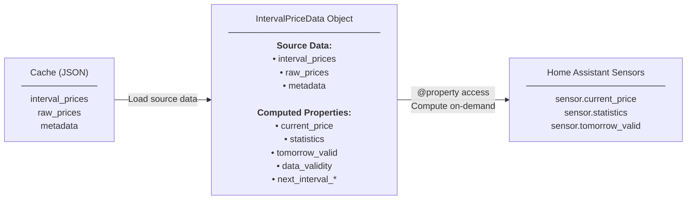

# Cache Architecture: Compute-on-Demand Pattern

## Overview

The cache system uses a **compute-on-demand** pattern: store only source data in the cache, compute everything else as properties when accessed. This keeps the cache simple and ensures computed values are always consistent with source data.

## Architecture Diagram



## Data Flow

1. **API** fetches raw data → **Parser** creates `StandardizedPriceData`
2. **Cache** stores only source data: `interval_prices`, `raw_prices`, `metadata`
3. **IntervalPriceData** loaded from cache with source data
4. **Sensors** access properties → computed on-demand from source data
5. **Properties** cache results internally (e.g., `@cached_property`)

## Key Principles

### ✅ DO Store in Cache
- `interval_prices` - Map of time → price
- `raw_prices` - Original API response
- `metadata` - Source info, area, currency, etc.

### ❌ DON'T Store in Cache
- `current_price` - Computed from `interval_prices` + current time
- `statistics` - Computed from `interval_prices`
- `tomorrow_valid` - Computed from data validity checks
- `data_validity` - Computed from interval counts vs. expectations

### Why?
- **Single Source of Truth**: Source data is the only truth
- **No Stale Data**: Computed values always match current source data
- **Smaller Cache**: Less storage, faster serialization
- **Simpler Logic**: No need to invalidate/recompute on cache updates

## Common Gotcha: API Instance Creation

### ⚠️ PROBLEM: Creating Instances for Metadata

**❌ WRONG:**
```python
# This creates unnecessary instances and TimezoneService initializations!
source = NordpoolAPI(config={}).source_type
source_name = api_class(config={}).source_type
```

**Why this is bad:**
- Creates full API instance just to read a static class attribute
- Each API instance creates a TimezoneService instance
- Analysis showed 57 TimezoneService instances instead of expected 8
- 49 extra instances = 49 wasted initializations

**✅ CORRECT:**
```python
# Use class attribute directly - no instance needed!
source = NordpoolAPI.SOURCE_TYPE
source_name = api_class.SOURCE_TYPE
```

**Why this is good:**
- No instance creation overhead
- No TimezoneService initialization
- Cleaner code, faster execution
- Static metadata should be accessed statically

### Implementation Pattern

All API classes now define `SOURCE_TYPE` as a class attribute:

```python
class NordpoolAPI(BasePriceAPI):
    """API implementation for Nordpool."""
    
    SOURCE_TYPE = Source.NORDPOOL  # ✅ Class attribute
    
    def __init__(self, config=None, session=None, timezone_service=None):
        super().__init__(config, session, timezone_service)
        # ... rest of initialization
```

## Sensor Access Pattern

Sensors access IntervalPriceData properties, not dict methods:

**❌ WRONG:**
```python
# Old pattern (when cache stored dicts)
current = data.get("current_price")
stats = data.get("statistics", {})
```

**✅ CORRECT:**
```python
# New pattern (IntervalPriceData with properties)
current = data.current_price
stats = data.statistics
valid = data.tomorrow_valid
```

## Performance Monitoring

TimezoneService instantiations are tracked with a global counter:

```python
# In timezone/service.py
_TZ_SERVICE_COUNT = 0  # Global counter

class TimezoneService:
    def __init__(self, ...):
        global _TZ_SERVICE_COUNT
        _TZ_SERVICE_COUNT += 1
        _LOGGER.debug(f"TimezoneService #{_TZ_SERVICE_COUNT} created for area='{area or 'None'}'")
```

Watch logs for `TimezoneService #N created` messages:
- **Expected**: ~8 instances (one per area/coordinator)
- **Before Phase 1**: 57 instances (49 unnecessary)
- **After Phase 1**: ~8 instances (fixed!)

## Log Message Context

Tomorrow data warnings are now context-aware:

```python
# Before 14:00 (expected): DEBUG level
_LOGGER.debug(f"Tomorrow data not yet available (before 14:00): {count}/{expected}")

# After 14:00 (unexpected): WARNING level
_LOGGER.warning(f"Incomplete tomorrow data: {count}/{expected} intervals")
```

This reduces log noise during normal operations (tomorrow data is published ~13:00 CET).

## Testing

All critical paths have test coverage (337/337 passing):
- ✅ Data fetching from all sources
- ✅ Fallback mechanism
- ✅ Cache storage/retrieval
- ✅ Timezone calculations
- ✅ Data validity computation
- ✅ Sensor value extraction (properties)
- ✅ Currency conversion
- ✅ VAT application
- ✅ Health checks

## Summary

**Key Takeaway:** The compute-on-demand pattern keeps cache simple and data consistent. Always access static metadata via class attributes, not instance creation. Properties compute values on-demand from source data stored in cache.

**Result:** Clean architecture, smaller cache, no stale data, better performance.
