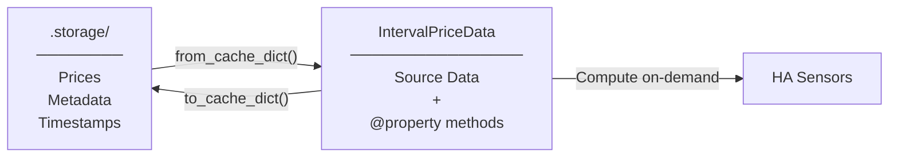

# Cache Architecture: Compute-on-Demand

**Pattern:** Store source data only, compute everything else as `@property` when accessed.

**Result:** Cache stays simple, computed values always match source data, fixes Issue #44.



## What's Stored vs. Computed

| Stored in Cache (34 fields) | Computed @property (13 fields) |
|------------------------------|--------------------------------|
| `today_interval_prices` | `data_validity` |
| `tomorrow_interval_prices` | `statistics` / `tomorrow_statistics` |
| `today_raw_prices` / `tomorrow_raw_prices` | `current_price` / `next_interval_price` |
| `export_today_prices` / `export_tomorrow_prices` | `current_interval_key` / `next_interval_key` |
| `export_enabled` | `tomorrow_valid` / `has_tomorrow_prices` |
| Metadata: `source`, `area`, `source_currency`, `target_currency` | `export_current_price` / `export_next_interval_price` |
| Timezones: `source_timezone`, `target_timezone` | `export_statistics` / `export_tomorrow_statistics` |
| Currency: `ecb_rate`, `ecb_updated` | |
| Display: `vat_rate`, `vat_included`, `display_unit` | |
| Timestamps: `fetched_at`, `last_updated` | |
| Migration: `migrated_from_tomorrow`, `original_cache_date` | |
| Fallback: `attempted_sources`, `fallback_sources`, `using_cached_data` | |
| Source health: `_validated_sources`, `_failed_sources` | |
| Errors: `_error`, `_error_code`, `_consecutive_failures`, `_all_attempted_sources` | |
| Debug: `data_source_attribution`, `raw_data`, `raw_interval_prices_original` | |

**Why separate?** Single source of truth, no stale data, smaller cache, simpler logic.

## Code Patterns

### Sensor Access
```python
# ✅ Use properties
current = data.current_price
stats = data.statistics

# ❌ Don't use dict access
current = data.get("current_price")
```

### API Metadata
```python
# ✅ Class attribute (no instance)
source = NordpoolAPI.SOURCE_TYPE

# ❌ Instance creation (wasteful)
source = NordpoolAPI(config={}).source_type
```

### Cache Operations
```python
# Store: serializes source data only
cache_dict = data.to_cache_dict()  # 34 fields

# Load: reconstructs with tz_service injection
data = IntervalPriceData.from_cache_dict(cache_dict, tz_service)

# Properties compute automatically
validity = data.data_validity  # Fresh calculation
```

## Testing

**492 tests** verify:
- `to_cache_dict()` / `from_cache_dict()` serialization
- Computed properties (data_validity, statistics)
- Source data only in cache (no computed fields)
- Midnight migration (`migrate_to_new_day()`)

```bash
pytest tests/pytest/unit/test_data_models.py -v
```

## Cache File Example

`.storage/` files contain source data only (34 fields):

```json
{
  "today_interval_prices": {"00:00": 0.25, "00:15": 0.28},
  "tomorrow_interval_prices": {"00:00": 0.22},
  "today_raw_prices": {"00:00": 0.20},
  "tomorrow_raw_prices": {},
  "export_today_prices": {"00:00": 0.18},
  "export_tomorrow_prices": {},
  "export_enabled": true,
  "source": "nordpool",
  "area": "SE4",
  "source_currency": "EUR",
  "target_currency": "SEK",
  "source_timezone": "Europe/Stockholm",
  "target_timezone": "Europe/Stockholm",
  "ecb_rate": 11.45,
  "ecb_updated": "2025-01-30T15:00:00+00:00",
  "vat_rate": 0.25,
  "vat_included": true,
  "display_unit": "SEK/kWh",
  "fetched_at": "2025-01-30T14:30:00+00:00",
  "last_updated": "2025-01-30T14:30:00+00:00",
  "migrated_from_tomorrow": false,
  "original_cache_date": null,
  "attempted_sources": ["nordpool"],
  "fallback_sources": [],
  "using_cached_data": false,
  "_validated_sources": ["nordpool", "entsoe"],
  "_failed_sources": {},
  "_error": null,
  "_error_code": null,
  "_consecutive_failures": 0,
  "_all_attempted_sources": ["nordpool"],
  "data_source_attribution": null,
  "raw_data": null,
  "raw_interval_prices_original": null
}
```

**Not stored (13 @property methods):** `data_validity`, `statistics`, `tomorrow_statistics`, `current_price`, `next_interval_price`, `current_interval_key`, `next_interval_key`, `tomorrow_valid`, `has_tomorrow_prices`, `export_current_price`, `export_next_interval_price`, `export_statistics`, `export_tomorrow_statistics` - all computed on access.

**Impact:**
- Issue #44 fixed: `data_validity` always fresh after midnight migration
- Smaller files: 34 fields vs. 47+ (34 stored + 13 computed)
- No cache invalidation needed

---

**Summary:** Store source data (34 fields), compute on-demand via `@property` (13 fields). Sensors use `data.statistics`, not `data.get("statistics")`. 

**Midnight migration** (00:00-00:10 window): CacheManager checks yesterday's cache for tomorrow_interval_prices, calls `migrate_to_new_day()` which moves tomorrow→today and clears tomorrow data. Properties (`data_validity`, `statistics`, etc.) auto-recalculate from new source data.

**Verified against code:**
- `to_cache_dict()`: Returns 34 fields (data_models.py:503-548)
- `from_cache_dict()`: Reconstructs with `_tz_service` injection (data_models.py:551)
- `migrate_to_new_day()`: Moves tomorrow→today, clears tomorrow (data_models.py:452-490)
- `@property` methods: 13 computed fields (data_models.py:123-413)
- Midnight migration: 10-minute window after midnight (cache_manager.py:228-287)
- Sensor access: Uses properties, not dict methods (sensor/price.py:122,141,219,272,286,350,363)
- API metadata: `api_class.SOURCE_TYPE` (no instances) (coordinator/unified_price_manager.py:445,685)
